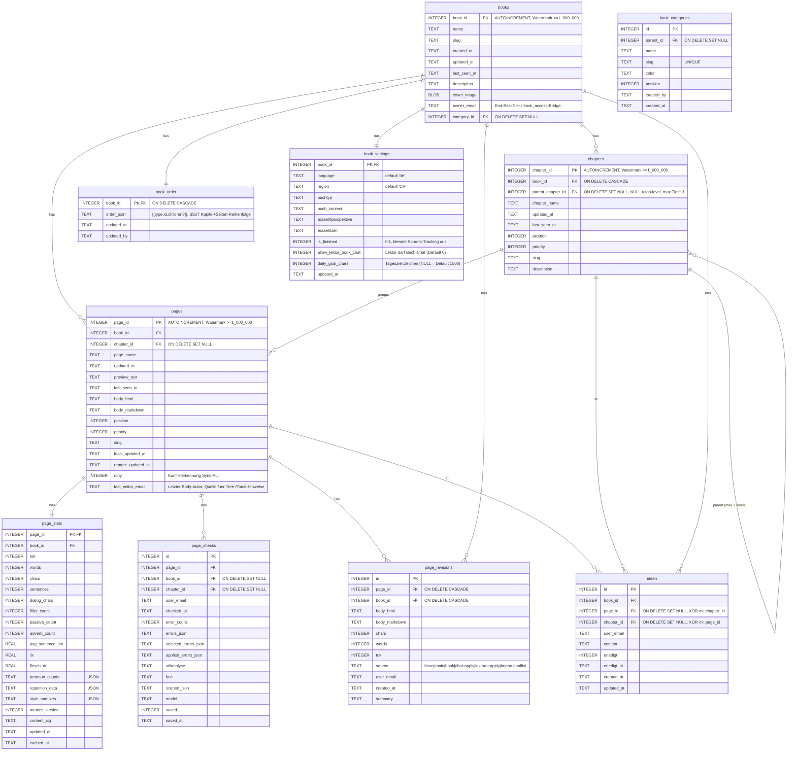
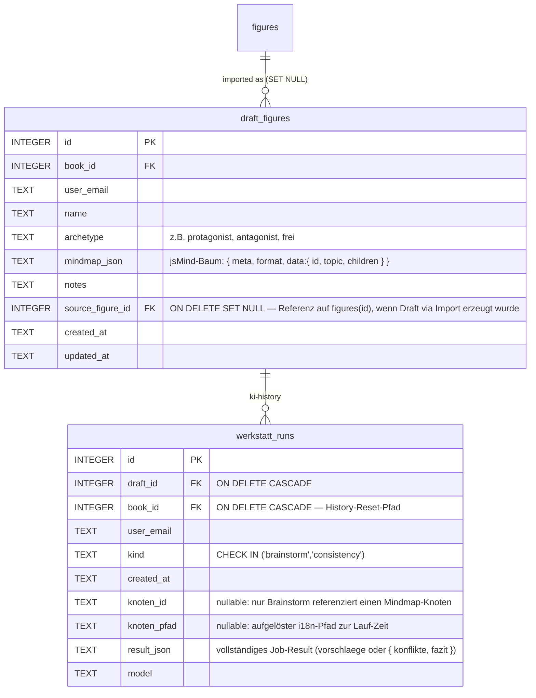
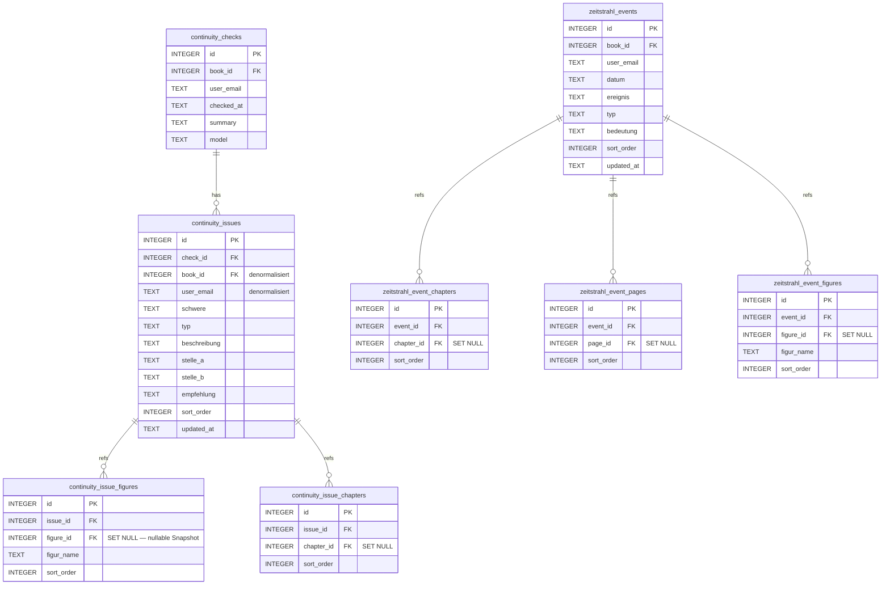

# ERD — schreibwerkstatt

Stand: Schema-Version 148, 82 Tabellen (ohne `sqlite_*`/`schema_version`/FTS5-Shadow-Tables; inkl. FTS5-Virtual `search_index`/`search_trigram` + `search_meta`).

Quelle: Squashed-Schema-Snapshot in [db/squashed-schema.js](../db/squashed-schema.js) (regeneriert via `node tools/dump-schema.js`) + [db/migrations.js](../db/migrations.js). Drift gegen die Legacy-Migration-Kette ist durch [tests/unit/squash-drift.test.mjs](../tests/unit/squash-drift.test.mjs) gegated. Mermaid-Diagramme — in VSCode mit „Markdown Preview Mermaid Support" (oder GitHub) direkt sichtbar.

> **Pflege.** Datei MUSS bei jeder neuen Migration mitgepflegt werden — Stand-Zeile (Schema-Version, Tabellen-Anzahl) + betroffene Block-Definitionen + ggf. neue Mermaid-Tabelle/-Kante. Siehe Doku-Regel in [CLAUDE.md](../CLAUDE.md) → „Datenbank → Migration hinzufügen". **Nach jeder Migration zusätzlich [db/squashed-schema.js](../db/squashed-schema.js) regenerieren** (`node tools/dump-schema.js > /tmp/out.sql` + Build-Step) — sonst bricht der Drift-Test in CI.

---

## 1 · Übersicht (alle FK-Kanten, ohne Attribute)

```mermaid
erDiagram
  books ||--o{ chapters              : has
  books ||--o{ pages                 : has
  chapters ||--o{ pages              : groups
  chapters ||--o{ chapters           : "parent (max 3 levels)"

  books ||--o{ figures               : has
  books ||--o{ locations             : has
  books ||--o{ figure_scenes         : has
  books ||--o{ songs                 : has
  books ||--o{ figure_relations      : has
  books ||--o{ zeitstrahl_events     : has
  books ||--o{ continuity_checks     : has
  books ||--o{ continuity_issues     : has
  books ||--o{ book_reviews          : has
  books ||--o{ chapter_reviews       : has
  books ||--o{ book_stats_history    : has
  books ||--o{ page_stats            : has
  books ||--|| book_settings         : has
  books ||--o{ job_checkpoints       : has
  books ||--o{ job_runs              : has
  books ||--o{ chat_sessions         : has
  books ||--o{ ideen                 : has
  books ||--o{ pdf_export_profile    : has
  books ||--o{ user_page_usage       : has
  books ||--o{ book_access           : has
  books ||--o{ book_share_invites    : has
  books ||--o{ page_locks            : locks
  books ||--o{ writing_time          : has
  books ||--o{ lektorat_time         : has
  books ||--o{ chapter_extract_cache : has
  books ||--o{ book_extract_cache    : has
  books ||--o{ chapter_review_cache  : has
  books ||--o{ book_review_cache     : has
  books ||--o{ chapter_macro_review_cache : has
  books ||--o{ lektorat_cache        : has
  books ||--o{ finetune_ai_cache     : has
  books ||--o{ draft_figures         : has
  books ||--o{ werkstatt_runs        : has
  books }o--o| book_categories       : "category_id"
  books ||--o| blog_connections      : "wp-link"
  blog_connections ||--o{ blog_page_links : "has"
  pages ||--o| blog_page_links       : "wp-mirror"
  books ||--o| hubspot_connections   : "hubspot-link"
  hubspot_connections ||--o{ hubspot_page_links : "has"
  pages ||--o| hubspot_page_links    : "hubspot-mirror"

  books ||--o{ share_links           : has
  pages ||--o{ share_links           : "shared as page"
  chapters ||--o{ share_links        : "shared as chapter"
  app_users ||--o{ share_links       : owns
  share_links ||--o{ share_comments  : has

  book_categories ||--o{ book_categories : parent

  draft_figures ||--o{ werkstatt_runs : "ki-history"

  pages ||--o{ page_checks           : has
  pages ||--|| page_stats            : has
  pages ||--o{ chat_sessions         : has
  pages ||--o{ page_figure_mentions  : has
  pages ||--o{ figure_events         : at
  pages ||--o{ figure_scenes         : at
  pages ||--o{ zeitstrahl_event_pages: at
  pages ||--o{ ideen                 : at
  pages ||--o{ lektorat_time         : on
  pages ||--o{ lektorat_cache        : cached
  pages ||--o{ page_languagetool_cache : cached
  pages ||--o{ locations             : firstMention
  pages ||--o{ songs                 : firstMention
  pages ||--o{ figures               : firstMention
  pages ||--|| page_locks            : locked
  pages ||--o{ page_revisions        : has
  books ||--o{ page_revisions        : has
  books ||--|| book_order            : has

  app_users ||--o{ book_access       : grants
  app_users ||--o{ page_locks        : holds
  app_users ||--o{ page_presence     : pings
  app_users ||--o{ app_users_devices : "owns devices"
  app_users ||--o{ budget_alerts     : dedupes

  user_invites ||--o{ registration_requests : "linked invite"
  pages ||--o{ page_presence         : "online viewers"
  books ||--o{ page_presence         : has
  app_users_devices ||--o{ page_presence : "pinged from"

  chapters ||--o{ figure_appearances     : has
  chapters ||--o{ figure_events          : at
  chapters ||--o{ figure_scenes          : at
  chapters ||--o{ location_chapters      : has
  chapters ||--o{ continuity_issue_chapters : ref
  chapters ||--o{ zeitstrahl_event_chapters : at
  chapters ||--o{ chapter_reviews        : has
  chapters ||--o{ chapter_extract_cache  : cached
  chapters ||--o{ chapter_review_cache   : cached
  chapters ||--o{ chapter_macro_review_cache : cached
  chapters ||--o{ ideen                  : at
  chapters ||--o{ pages                  : groups
  chapters ||--o{ page_checks            : ref

  figures ||--o{ figure_tags             : tagged
  figures ||--o{ figure_appearances      : appears
  figures ||--o{ figure_events           : has
  figures ||--o{ scene_figures           : in
  figures ||--o{ location_figures        : at
  figures ||--o{ song_figures            : likes
  figures ||--o{ page_figure_mentions    : mentioned
  figures ||--o{ continuity_issue_figures: ref
  figures ||--o{ zeitstrahl_event_figures: ref
  figures ||--o{ figure_relations        : from
  figures ||--o{ figure_relations        : to
  figures ||--o{ draft_figures           : "imported as"

  locations ||--o{ scene_locations       : in
  locations ||--o{ location_figures      : has
  locations ||--o{ location_chapters     : at

  songs ||--o{ song_scenes               : in
  songs ||--o{ song_figures              : has
  songs ||--o{ song_chapters             : at

  figure_scenes ||--o{ scene_figures     : has
  figure_scenes ||--o{ scene_locations   : has
  figure_scenes ||--o{ song_scenes       : has
  chapters ||--o{ song_chapters          : has

  zeitstrahl_events ||--o{ zeitstrahl_event_chapters : refs
  zeitstrahl_events ||--o{ zeitstrahl_event_pages    : refs
  zeitstrahl_events ||--o{ zeitstrahl_event_figures  : refs

  continuity_checks ||--o{ continuity_issues          : has
  continuity_issues ||--o{ continuity_issue_figures   : refs
  continuity_issues ||--o{ continuity_issue_chapters  : refs

  chat_sessions ||--o{ chat_messages     : has
```

---

## 2 · Buch-Hierarchie + Lektorat-Kern



---

## 3 · Figuren + Beziehungen

```mermaid
erDiagram
  figures {
    INTEGER id           PK
    INTEGER book_id      FK
    TEXT    fig_id       "stable text-id from AI"
    TEXT    name
    TEXT    kurzname
    TEXT    typ
    TEXT    geschlecht
    TEXT    geburtstag
    TEXT    beruf
    TEXT    sozialschicht
    TEXT    rolle
    TEXT    motivation
    TEXT    konflikt
    TEXT    entwicklung
    TEXT    praesenz
    TEXT    erste_erwaehnung
    INTEGER erste_erwaehnung_page_id FK "SET NULL"
    TEXT    schluesselzitate
    TEXT    wohnadresse
    TEXT    beschreibung
    TEXT    meta
    INTEGER sort_order
    TEXT    user_email
    TEXT    updated_at
  }
  figure_tags {
    INTEGER figure_id PK,FK
    TEXT    tag       PK
  }
  figure_relations {
    INTEGER id              PK
    INTEGER book_id         FK
    INTEGER from_fig_id     FK
    INTEGER to_fig_id       FK
    TEXT    typ             "freie Bezeichnung"
    TEXT    beschreibung
    INTEGER machtverhaltnis
    TEXT    belege
    TEXT    user_email      "UNIQUE(book_id, from_fig_id, to_fig_id, typ, user_email)"
  }
  figure_appearances {
    INTEGER figure_id   FK
    INTEGER chapter_id  FK
    INTEGER haeufigkeit
  }
  figure_events {
    INTEGER id         PK
    INTEGER figure_id  FK
    INTEGER chapter_id FK "SET NULL"
    INTEGER page_id    FK "SET NULL"
    TEXT    datum
    TEXT    ereignis
    TEXT    bedeutung
    TEXT    typ
    INTEGER sort_order
  }
  page_figure_mentions {
    INTEGER page_id      PK,FK
    INTEGER figure_id    PK,FK
    INTEGER count
    INTEGER first_offset
  }
  figure_scenes {
    INTEGER id          PK
    INTEGER book_id     FK
    INTEGER chapter_id  FK "SET NULL"
    INTEGER page_id     FK "SET NULL"
    TEXT    titel
    TEXT    wertung
    TEXT    kommentar
    INTEGER sort_order
    TEXT    user_email
    TEXT    updated_at
  }
  scene_figures {
    INTEGER scene_id  PK,FK
    INTEGER figure_id PK,FK
  }
  scene_locations {
    INTEGER scene_id    PK,FK
    INTEGER location_id PK,FK
  }
  locations {
    INTEGER id           PK
    INTEGER book_id      FK
    TEXT    loc_id
    TEXT    name
    TEXT    typ
    TEXT    beschreibung
    TEXT    erste_erwaehnung
    INTEGER erste_erwaehnung_page_id FK "SET NULL"
    TEXT    stimmung
    INTEGER sort_order
    TEXT    user_email
    TEXT    updated_at
  }
  location_figures {
    INTEGER location_id PK,FK
    INTEGER figure_id   PK,FK
  }
  location_chapters {
    INTEGER location_id PK,FK
    INTEGER chapter_id  PK,FK
    INTEGER haeufigkeit
  }
  songs {
    INTEGER id           PK
    INTEGER book_id      FK
    TEXT    song_uid
    TEXT    titel
    TEXT    interpret
    TEXT    genre
    TEXT    kontext_typ  "hört|spielt|erwähnt|leitmotiv|diegetisch"
    TEXT    beschreibung
    TEXT    stimmung
    TEXT    erste_erwaehnung
    INTEGER erste_erwaehnung_page_id FK "SET NULL"
    INTEGER sort_order
    TEXT    user_email
    TEXT    updated_at
  }
  song_figures {
    INTEGER song_id     PK,FK
    INTEGER figure_id   PK,FK
    TEXT    kontext_typ "Override pro Figur (z.B. hört vs. spielt)"
  }
  song_chapters {
    INTEGER song_id     PK,FK
    INTEGER chapter_id  PK,FK
    INTEGER haeufigkeit
  }
  song_scenes {
    INTEGER scene_id PK,FK
    INTEGER song_id  PK,FK
  }

  figures   ||--o{ figure_tags        : tagged
  figures   ||--o{ figure_relations   : from
  figures   ||--o{ figure_relations   : to
  figures   ||--o{ figure_appearances : appears
  figures   ||--o{ figure_events      : has
  figures   ||--o{ page_figure_mentions: mentioned
  figures   ||--o{ scene_figures      : in
  figures   ||--o{ location_figures   : at
  figures   ||--o{ song_figures       : likes
  figure_scenes ||--o{ scene_figures  : has
  figure_scenes ||--o{ scene_locations: has
  figure_scenes ||--o{ song_scenes    : has
  locations ||--o{ scene_locations    : in
  locations ||--o{ location_figures   : has
  locations ||--o{ location_chapters  : at
  songs     ||--o{ song_figures       : has
  songs     ||--o{ song_chapters      : at
  songs     ||--o{ song_scenes        : in
  chapters  ||--o{ song_chapters      : has
```

### 3a · Figuren-Werkstatt (isoliert, kein Promotion-Pfad zu `figures`)



`draft_figures` lebt parallel zu `figures`. `source_figure_id` referenziert die Quell-Figur, wenn der Draft via `POST /draft-figures/:book_id/import` aus dem Figuren-Katalog erzeugt wurde — `ON DELETE SET NULL` schützt User-kuratierte Mindmap-Arbeit, wenn die Quell-Figur (z.B. durch Komplettanalyse-Reextraktion) verschwindet. Werkstatt-Jobs (Brainstorm/Consistency) blenden die Quell-Figur per `source_figure_id` aus dem Buch-Kontext aus, damit sie sich nicht selbst widerspricht. Es gibt weiterhin keinen Promotion-Pfad zurück nach `figures` — der Import ist einseitig.

`werkstatt_runs` historisiert jeden KI-Lauf (Brainstorm + Consistency-Check) als kompletten Result-JSON. `ON DELETE CASCADE` auf `draft_id`: Run-Historie stirbt mit dem Draft. `book_id` redundant für den `DELETE /history/book/:id`-Reset-Pfad (per User). Frontend zeigt zwei klappbare Sektionen pro Draft; Klick lädt den Lauf wie einen Live-Run, Apply (Brainstorm) prüft client-seitig, ob `knoten_id` noch in der aktuellen Mindmap existiert.

---

## 4 · Continuity & Zeitstrahl



---

## 5 · Chat, Reviews, Jobs, Caches, User, Export

```mermaid
erDiagram
  chat_sessions {
    INTEGER id              PK
    INTEGER book_id         FK
    TEXT    kind            "page|book"
    INTEGER page_id         FK "NULL bei kind=book"
    TEXT    user_email
    TEXT    created_at
    TEXT    last_message_at
    TEXT    opening_page_text
  }
  chat_messages {
    INTEGER id                PK
    INTEGER session_id        FK
    TEXT    role              "user|assistant"
    TEXT    content
    TEXT    vorschlaege       "JSON"
    TEXT    context_info
    TEXT    provider          "claude|ollama|llama"
    TEXT    model
    INTEGER tokens_in
    INTEGER tokens_out
    INTEGER cache_read_in     "Claude prompt-cache hit (lokal: 0)"
    INTEGER cache_creation_in "Claude prompt-cache write (lokal: 0)"
    REAL    tps
    TEXT    created_at
  }

  book_reviews {
    INTEGER id          PK
    INTEGER book_id     FK
    TEXT    user_email
    TEXT    reviewed_at
    TEXT    review_json
    TEXT    model
  }
  chapter_reviews {
    INTEGER id          PK
    INTEGER book_id     FK
    INTEGER chapter_id  FK
    TEXT    user_email
    TEXT    reviewed_at
    TEXT    review_json
    TEXT    model
  }
  book_stats_history {
    INTEGER id            PK
    INTEGER book_id       FK
    TEXT    recorded_at
    INTEGER page_count
    INTEGER words
    INTEGER chars
    INTEGER tok
    INTEGER unique_words
    INTEGER chapter_count
    REAL    avg_sentence_len
    REAL    avg_lix
    REAL    avg_flesch_de
  }

  job_runs {
    INTEGER id          PK
    TEXT    job_id      "UNIQUE"
    TEXT    type
    INTEGER book_id     FK "SET NULL"
    TEXT    user_email
    TEXT    label
    TEXT    status      "queued|running|done|error|cancelled"
    TEXT    queued_at
    TEXT    started_at
    TEXT    ended_at
    INTEGER tokens_in
    INTEGER tokens_out
    INTEGER cache_read_in     "Claude prompt-cache hit (lokal: 0)"
    INTEGER cache_creation_in "Claude prompt-cache write (lokal: 0)"
    TEXT    provider          "claude|ollama|llama"
    TEXT    model
    REAL    tokens_per_sec
    TEXT    error
    TEXT    error_params  "JSON, i18n-Params zum error-Key"
  }
  job_checkpoints {
    INTEGER id          PK
    TEXT    job_type
    INTEGER book_id     FK
    TEXT    user_email
    TEXT    data
    TEXT    updated_at
  }
  chapter_extract_cache {
    INTEGER book_id      PK,FK
    TEXT    user_email   PK
    INTEGER chapter_id   PK,FK
    TEXT    phase        PK
    TEXT    provider     PK
    TEXT    pages_sig
    TEXT    extract_json
    TEXT    cached_at
  }
  book_extract_cache {
    INTEGER book_id      PK,FK
    TEXT    user_email   PK
    TEXT    provider     PK
    TEXT    pages_sig
    TEXT    extract_json
    TEXT    cached_at
  }
  chapter_review_cache {
    INTEGER book_id      PK,FK
    TEXT    user_email   PK
    INTEGER chapter_id   PK,FK
    TEXT    phase        PK
    TEXT    provider     PK
    TEXT    pages_sig
    TEXT    review_json
    TEXT    cached_at
  }
  book_review_cache {
    INTEGER book_id      PK,FK
    TEXT    user_email   PK
    TEXT    provider     PK
    TEXT    pages_sig
    TEXT    review_json
    TEXT    cached_at
  }
  chapter_macro_review_cache {
    INTEGER book_id      PK,FK
    TEXT    user_email   PK
    INTEGER chapter_id   PK,FK
    TEXT    provider     PK
    TEXT    pages_sig
    TEXT    review_json
    TEXT    cached_at
  }
  synonym_cache {
    TEXT    user_email   PK
    TEXT    provider     PK
    TEXT    key_hash     PK
    TEXT    result_json
    TEXT    cached_at
  }
  lektorat_cache {
    INTEGER book_id      PK,FK
    TEXT    user_email   PK
    INTEGER page_id      PK,FK
    TEXT    provider     PK
    TEXT    ctx_sig
    TEXT    result_json
    TEXT    cached_at
  }
  finetune_ai_cache {
    INTEGER book_id    PK,FK
    TEXT    user_email PK
    TEXT    scope      PK
    TEXT    scope_key  PK
    TEXT    version    PK
    TEXT    sig
    TEXT    result_json
    TEXT    cached_at
  }
  page_languagetool_cache {
    INTEGER page_id      PK,FK "CASCADE"
    TEXT    content_hash PK    "sha1 ueber LT-Eingabetext"
    TEXT    lang         PK    "LT-Locale-Tag (de-CH, en-US, auto)"
    INTEGER picky        PK    "0/1, picky-Mode an/aus"
    TEXT    matches_json       "JSON-Array von LT-Matches"
    TEXT    created_at
  }
  user_dictionary {
    TEXT    user_email PK,FK "CASCADE auf app_users"
    INTEGER book_id    PK    "0 = global, sonst pro Buch"
    TEXT    word       PK    "User-spezifisches Wort"
    TEXT    lang       PK    "* = alle Sprachen, sonst Locale-Tag"
    TEXT    created_at
  }

  app_users {
    INTEGER id               PK "AUTOINCREMENT"
    TEXT    email            "UNIQUE, lowercase-normalisiert"
    TEXT    display_name
    TEXT    avatar_url
    TEXT    global_role      "admin | user (Default user)"
    TEXT    status           "invited | active | suspended | deleted"
    TEXT    language         "UI-Sprache (de | en)"
    TEXT    model_override
    INTEGER can_invite_users "Default 1; Admin entzieht bei Missbrauch"
    TEXT    first_seen_at
    TEXT    last_seen_at
    TEXT    last_login_at
    TEXT    invited_by
    TEXT    invited_at
    TEXT    created_at
    TEXT    theme             "auto | light | dark"
    TEXT    default_buchtyp
    TEXT    default_language  "Buch-Default (de | en)"
    TEXT    default_region    "Buch-Default (CH | DE | US | GB)"
    TEXT    focus_granularity "paragraph | sentence | window-3 | typewriter-only"
    REAL    monthly_budget_usd "NULL = kein numerisches Limit"
    TEXT    budget_mode        "none | soft | hard (Default none)"
    TEXT    ai_provider_override "NULL = follows global ai.provider; CHECK in ('claude','ollama','llama')"
  }
  user_invites {
    INTEGER id              PK "AUTOINCREMENT"
    TEXT    email
    TEXT    global_role     "admin | user"
    TEXT    invite_token    "UNIQUE"
    TEXT    invited_by
    TEXT    invited_at
    TEXT    expires_at
    TEXT    accepted_at     "NULL = noch offen"
    TEXT    revoked_at
    TEXT    last_clicked_at "Mig 144"
    INTEGER click_count
    TEXT    last_reminder_at
    INTEGER reminder_count
  }
  user_sessions_audit {
    INTEGER id         PK "AUTOINCREMENT"
    TEXT    user_email
    TEXT    event      "login | logout | login-denied | suspended | reactivated | role-changed | deleted | budget-changed | usage-viewed"
    TEXT    ip
    TEXT    user_agent
    TEXT    meta_json  "JSON-Encoded Detail (method, from/to-Rolle, ...)"
    TEXT    created_at
  }
  book_access {
    INTEGER book_id     PK,FK "books(book_id) CASCADE"
    TEXT    user_email  PK,FK "app_users(email) CASCADE"
    TEXT    role        "owner | editor | lektor | viewer"
    TEXT    granted_at
    TEXT    granted_by
  }
  book_share_invites {
    INTEGER id            PK "AUTOINCREMENT"
    INTEGER book_id       FK "books(book_id) CASCADE"
    TEXT    invitee_email
    TEXT    role          "editor | lektor | viewer"
    TEXT    invited_by
    TEXT    invited_at
    TEXT    accepted_at   "NULL = noch offen"
    TEXT    revoked_at
  }
  page_locks {
    INTEGER page_id            PK,FK "pages(page_id) CASCADE"
    INTEGER book_id            FK "books(book_id) CASCADE"
    TEXT    locked_by_email    FK "app_users(email) CASCADE"
    TEXT    reason             "lektorat | edit"
    TEXT    acquired_at
    TEXT    expires_at         "TTL 30 min, Heartbeat verlängert"
    TEXT    last_heartbeat_at
  }
  page_presence {
    INTEGER page_id      PK,FK "pages(page_id) CASCADE"
    TEXT    user_email   PK,FK "app_users(email) CASCADE"
    TEXT    device_id    PK,FK "app_users_devices(device_id) CASCADE"
    INTEGER book_id      FK    "books(book_id) CASCADE"
    TEXT    last_ping_at "Default now"
  }
  app_users_devices {
    TEXT device_id     PK
    TEXT user_email    FK "app_users(email) CASCADE"
    TEXT label         "Auto-Label aus UA (z.B. 'Chrome · macOS')"
    TEXT user_agent
    TEXT created_at
    TEXT last_seen_at
  }
  budget_alerts {
    TEXT email   PK,FK "app_users(email) CASCADE"
    TEXT period  PK   "YYYY-MM (UTC) — 1 Mail pro User pro Monat"
    TEXT sent_at
  }
  registration_requests {
    INTEGER id            PK "AUTOINCREMENT"
    TEXT    email
    TEXT    display_name
    TEXT    message
    TEXT    ip
    TEXT    user_agent
    TEXT    status        "pending | approved | denied | expired"
    TEXT    created_at
    TEXT    reviewed_at
    TEXT    reviewed_by
    TEXT    review_reason
    INTEGER invite_id     FK "user_invites(id) SET NULL"
  }
  user_activity {
    TEXT    user_email PK
    TEXT    date       PK
    INTEGER seconds
    TEXT    first_at
    TEXT    last_at
  }
  user_feature_usage {
    TEXT    user_email   PK
    TEXT    feature_key  PK
    INTEGER last_used
    INTEGER use_count
  }
  user_page_usage {
    TEXT    user_email PK
    INTEGER page_id    PK
    INTEGER book_id    FK
    INTEGER last_used
    INTEGER use_count
  }
  writing_time {
    INTEGER id         PK
    TEXT    user_email
    INTEGER book_id    FK
    TEXT    date
    INTEGER seconds
  }
  lektorat_time {
    INTEGER id         PK
    TEXT    user_email
    INTEGER book_id    FK
    INTEGER page_id    FK
    TEXT    date
    INTEGER seconds
  }

  pdf_export_profile {
    INTEGER id          PK
    TEXT    kind        "book|user_default"
    INTEGER book_id     FK "NULL bei user_default"
    TEXT    user_email
    TEXT    name
    TEXT    config_json
    BLOB    cover_image
    TEXT    cover_mime
    INTEGER is_default
    INTEGER created_at
    INTEGER updated_at
  }
  font_cache {
    TEXT    family    PK
    INTEGER weight    PK
    TEXT    style     PK
    BLOB    ttf
    INTEGER fetched_at
  }

  app_settings {
    TEXT    key        PK
    TEXT    value_json
    INTEGER encrypted  "0|1, AES-256-GCM bei 1"
    TEXT    updated_at
    TEXT    updated_by
  }
  app_settings_audit {
    INTEGER id         PK "AUTOINCREMENT"
    TEXT    key
    TEXT    old_hash
    TEXT    new_hash
    TEXT    updated_by
    TEXT    updated_at
  }
  search_index {
    TEXT kind      "UNINDEXED — page|chapter|figure|location|scene|song"
    TEXT entity_id "UNINDEXED"
    TEXT book_id   "UNINDEXED"
    TEXT lang      "UNINDEXED"
    TEXT title     "FTS5"
    TEXT body      "FTS5 — unicode61 remove_diacritics 2"
  }
  search_trigram {
    TEXT kind      "UNINDEXED"
    TEXT entity_id "UNINDEXED"
    TEXT book_id   "UNINDEXED"
    TEXT title     "FTS5 — trigram tokenizer"
  }
  search_meta {
    TEXT key        PK
    TEXT value
    TEXT updated_at
  }

  blog_connections {
    INTEGER id                     PK
    INTEGER book_id                FK "UNIQUE — 1 Blog pro Buch"
    TEXT    base_url               "https:// nur"
    TEXT    username
    BLOB    password_enc           "AES via lib/crypto.js"
    TEXT    default_status         "draft|publish|private"
    TEXT    initial_import_done_at "NULL = noch nie importiert"
    TEXT    last_pull_at
    TEXT    last_push_at
    TEXT    created_at
    TEXT    updated_at
  }
  blog_page_links {
    INTEGER page_id        PK "FK pages(page_id) ON DELETE CASCADE"
    INTEGER blog_id        FK "FK blog_connections(id) ON DELETE CASCADE"
    INTEGER wp_post_id
    TEXT    wp_modified_at "last seen wp.modified_gmt"
    TEXT    wp_status      "publish|draft|private"
    TEXT    wp_slug
    TEXT    last_pulled_at
    TEXT    last_pushed_at
    TEXT    conflict_state "detected|resolved-app|resolved-wp"
  }
  hubspot_connections {
    INTEGER id                     PK
    INTEGER book_id                FK "UNIQUE — 1 HubSpot-Blog pro Buch"
    BLOB    token_enc              "AES-PAT via lib/crypto.js"
    TEXT    blog_id                "HubSpot contentGroupId"
    TEXT    author_id              "HubSpot blogAuthorId"
    TEXT    initial_import_done_at "NULL = noch nie importiert"
    TEXT    last_import_at
    TEXT    last_push_at
    TEXT    created_at
    TEXT    updated_at
  }
  hubspot_page_links {
    INTEGER page_id            PK "FK pages(page_id) ON DELETE CASCADE"
    INTEGER hub_id             FK "FK hubspot_connections(id) ON DELETE CASCADE"
    TEXT    hubspot_post_id    "UNIQUE(hub_id, hubspot_post_id)"
    TEXT    hubspot_state      "DRAFT|PUBLISHED|…"
    TEXT    hubspot_created_at
    TEXT    last_pushed_at
  }
  share_links {
    TEXT    token              PK "22-Zeichen base64url"
    TEXT    kind               "page|chapter (CHECK)"
    INTEGER page_id            FK "FK pages(page_id) — nur bei kind='page'"
    INTEGER chapter_id         FK "FK chapters(chapter_id) — nur bei kind='chapter'"
    INTEGER book_id            FK "FK books(book_id) ON DELETE CASCADE"
    TEXT    owner_email        FK "FK app_users(email) ON DELETE CASCADE"
    TEXT    intro              "Plaintext-Vorwort fuer Reader"
    TEXT    expires_at         "ISO-Timestamp oder NULL = nie"
    TEXT    revoked_at         "Soft-Delete-Marker"
    INTEGER view_count         "non-blocking Inkrement pro GET"
    TEXT    owner_last_seen_at "Unread-Tracking"
    TEXT    created_at         "DEFAULT NOW_ISO_SQL"
  }
  share_comments {
    INTEGER id           PK
    TEXT    share_token  FK "FK share_links(token) ON DELETE CASCADE"
    TEXT    reader_name  "max 80 Zeichen, nullable"
    TEXT    body         "max 4000 Zeichen"
    TEXT    ip_hash      "SHA-256(ip + Server-Salt) fuer Rate-Limit"
    TEXT    created_at
  }
  api_tokens {
    INTEGER id            PK
    TEXT    admin_email   FK "FK app_users(email) ON DELETE CASCADE"
    TEXT    token_hash    "SHA-256 des Plain-Tokens, UNIQUE"
    TEXT    display_name  "Label fuer Admin-UI"
    TEXT    scopes        "Komma-Liste, aktuell nur 'metrics:read'"
    TEXT    last_used_at  "ISO bei jedem erfolgreichen Scrape"
    TEXT    last_used_ip
    TEXT    expires_at    "ISO oder NULL = nie"
    TEXT    revoked_at    "Soft-Revoke-Marker"
    TEXT    created_at    "DEFAULT NOW_ISO_SQL"
  }

  books            ||--o| blog_connections  : "wp-link"
  blog_connections ||--o{ blog_page_links   : has
  pages            ||--o| blog_page_links   : "wp-mirror"
  books            ||--o| hubspot_connections   : "hubspot-link"
  hubspot_connections ||--o{ hubspot_page_links : has
  pages            ||--o| hubspot_page_links    : "hubspot-mirror"
  books            ||--o{ share_links       : has
  pages            ||--o{ share_links       : "shared as page"
  chapters         ||--o{ share_links       : "shared as chapter"
  app_users        ||--o{ share_links       : owns
  share_links      ||--o{ share_comments    : has
  app_users        ||--o{ api_tokens        : owns

  chat_sessions ||--o{ chat_messages : has
  user_invites  ||--o{ registration_requests : "linked invite"
```



---

## 6 · Pflege

Bei jeder neuen Migration in [db/migrations.js](../db/migrations.js):

1. Stand-Zeile oben anpassen (Version, Tabellen-Anzahl).
2. Betroffene Block-Definitionen anfassen (neue Spalte → Zeile in `{}`, neuer Typ-Hinweis als Annotation in `"…"`).
3. Bei neuer Tabelle: Block ergänzen + FK-Kante in Section 1 (Übersicht) + im passenden thematischen Sub-Diagramm.
4. Bei neuer FK-Kante auf bestehende Tabellen: Kante in Section 1 nachziehen.

Live-Schema kontrollieren:

```
sqlite3 schreibwerkstatt.db ".schema --indent" > /tmp/schema_full.sql
sqlite3 schreibwerkstatt.db "SELECT version FROM schema_version;"
```

Diagramm-Quellen sind die `REFERENCES`-Klauseln aus dem Dump. Mermaid-Diagramme händisch nachziehen — Auto-Generator wäre möglich, aber die Sub-Diagramme leben von kuratierter Auswahl, kein vollautomatisches Tool produziert sie sinnvoll.
