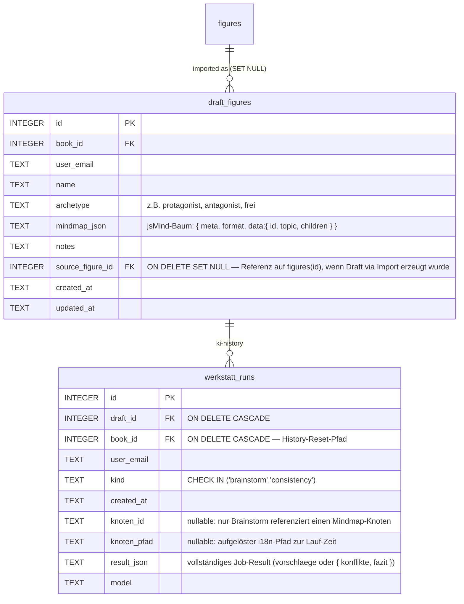
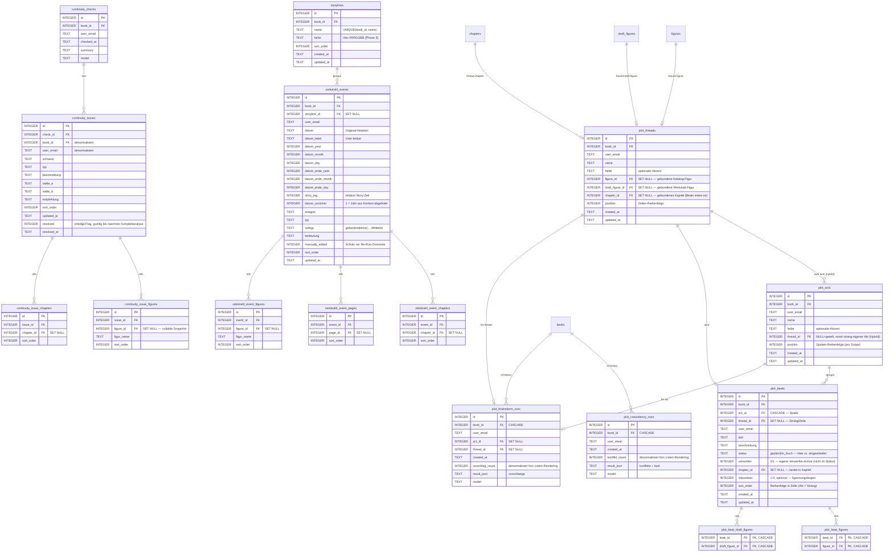

# ERD — schreibwerkstatt

Stand: Schema-Version 218, 109 Tabellen (ohne `sqlite_*`/`schema_version`/FTS5-Shadow-Tables; inkl. FTS5-Virtual `search_index`/`search_trigram` + `search_meta`).

Quelle: Squashed-Schema-Snapshot in [db/squashed-schema.js](../db/squashed-schema.js) (regeneriert via `node tools/dump-schema.js`) + [db/migrations.js](../db/migrations.js). Drift gegen die Legacy-Migration-Kette ist durch [tests/unit/squash-drift.test.mjs](../tests/unit/squash-drift.test.mjs) gegated. Mermaid-Diagramme — in VSCode mit „Markdown Preview Mermaid Support" (oder GitHub) direkt sichtbar.

> **Pflege.** Datei MUSS bei jeder neuen Migration mitgepflegt werden — Stand-Zeile (Schema-Version, Tabellen-Anzahl) + betroffene Block-Definitionen + ggf. neue Mermaid-Tabelle/-Kante. Siehe Doku-Regel in [CLAUDE.md](../CLAUDE.md) → „Datenbank → Migration hinzufügen". **Nach jeder Migration zusätzlich [db/squashed-schema.js](../db/squashed-schema.js) regenerieren** (`node tools/dump-schema.js > /tmp/out.sql` + Build-Step) — sonst bricht der Drift-Test in CI.

---

## 1 · Übersicht (alle FK-Kanten, ohne Attribute)

```mermaid
erDiagram
  books ||--o{ chapters              : has
  books ||--o{ pages                 : has
  chapters ||--o{ pages              : groups
  chapters ||--o{ chapters           : "parent (max 3 levels)"

  books ||--o{ figures               : has
  books ||--o{ locations             : has
  books ||--o{ figure_scenes         : has
  books ||--o{ songs                 : has
  books ||--o{ world_facts           : has
  books ||--o{ figure_relations      : has
  books ||--o{ zeitstrahl_events     : has
  books ||--o{ continuity_checks     : has
  books ||--o{ continuity_issues     : has
  books ||--o{ book_reviews          : has
  books ||--o{ chapter_reviews       : has
  books ||--o{ book_stats_history    : has
  books ||--o{ page_stats            : has
  books ||--|| book_settings         : has
  books ||--o{ job_checkpoints       : has
  books ||--o{ job_runs              : has
  books ||--o{ ai_cost_ledger        : has
  books ||--o{ chat_sessions         : has
  books ||--o{ ideen                 : has
  books ||--o{ pdf_export_profile    : has
  books ||--o{ docx_export_profile   : has
  books ||--|| book_publication      : has
  books ||--o{ user_page_usage       : has
  books ||--o{ book_access           : has
  books ||--o{ book_share_invites    : has
  books ||--o{ page_locks            : locks
  books ||--o{ writing_time          : has
  books ||--o{ writing_hour          : has
  books ||--o{ lektorat_time         : has
  books ||--o{ stt_time              : has
  books ||--o{ chapter_extract_cache : has
  books ||--o{ book_extract_cache    : has
  books ||--o{ chapter_review_cache  : has
  books ||--o{ book_review_cache     : has
  books ||--o{ chapter_macro_review_cache : has
  books ||--o{ tagebuch_rueckblick_cache : has
  books ||--o{ tagebuch_rueckblicke  : has
  books ||--o{ lektorat_cache        : has
  books ||--o{ finetune_ai_cache     : has
  books ||--o{ draft_figures         : has
  books ||--o{ werkstatt_runs        : has
  books ||--o{ storylines            : has
  storylines ||--o{ zeitstrahl_events : groups
  storylines ||--o{ figure_events     : groups
  books ||--o{ plot_acts             : has
  books ||--o{ plot_beats            : has
  books ||--o{ plot_threads          : has
  plot_acts ||--o{ plot_beats        : groups
  plot_threads ||--o{ plot_acts      : "own acts (hybrid)"
  plot_threads ||--o| plot_beats     : "beat in lane"
  figures ||--o| plot_threads        : "thread of figure"
  draft_figures ||--o| plot_threads  : "thread of draft figure"
  chapters ||--o| plot_threads       : "thread chapter"
  chapters ||--o| plot_beats         : "beat lands in"
  books ||--o{ plot_consistency_runs : has
  books ||--o{ plot_brainstorm_runs  : has
  plot_acts ||--o| plot_brainstorm_runs : "for act"
  plot_threads ||--o| plot_brainstorm_runs : "for thread"
  plot_beats ||--o{ plot_beat_figures : has
  figures ||--o{ plot_beat_figures   : "appears in beat"
  plot_beats ||--o{ plot_beat_draft_figures : has
  draft_figures ||--o{ plot_beat_draft_figures : "appears in beat"
  books }o--o| book_categories       : "category_id"
  books ||--o| blog_connections      : "wp-link"
  blog_connections ||--o{ blog_page_links : "has"
  pages ||--o| blog_page_links       : "wp-mirror"
  books ||--o| hubspot_connections   : "hubspot-link"
  hubspot_connections ||--o{ hubspot_page_links : "has"
  pages ||--o| hubspot_page_links    : "hubspot-mirror"

  books ||--o{ share_links           : has
  pages ||--o{ share_links           : "shared as page"
  chapters ||--o{ share_links        : "shared as chapter"
  app_users ||--o{ share_links       : owns
  share_links ||--o{ share_comments  : has

  book_categories ||--o{ book_categories : parent

  draft_figures ||--o{ werkstatt_runs : "ki-history"

  pages ||--o{ page_checks           : has
  pages ||--|| page_stats            : has
  pages ||--o{ chat_sessions         : has
  pages ||--o{ page_figure_mentions  : has
  pages ||--o{ figure_events         : at
  pages ||--o{ figure_scenes         : at
  pages ||--o{ zeitstrahl_event_pages: at
  pages ||--o{ ideen                 : at
  pages ||--o{ lektorat_time         : on
  pages ||--o{ lektorat_cache        : cached
  pages ||--o{ page_languagetool_cache : cached
  pages ||--o{ locations             : firstMention
  pages ||--o{ songs                 : firstMention
  pages ||--o{ figures               : firstMention
  pages ||--|| page_locks            : locked
  pages ||--o{ page_revisions        : has
  books ||--o{ page_revisions        : has
  books ||--|| book_order            : has

  app_users ||--o{ book_access       : grants
  app_users ||--o{ page_locks        : holds
  app_users ||--o{ page_presence     : pings
  app_users ||--o{ book_presence     : pings
  app_users ||--o{ app_users_devices : "owns devices"
  app_users ||--o{ budget_alerts     : dedupes
  app_users ||--o{ user_dictionary   : owns
  app_users ||--o{ js_errors         : logs
  books     ||--o{ user_dictionary   : "scoped (NULL=global)"

  user_invites ||--o{ registration_requests : "linked invite"
  pages ||--o{ page_presence         : "online viewers"
  pages ||--o{ book_presence         : "current page"
  books ||--o{ page_presence         : has
  books ||--o{ book_presence         : "open on devices"
  app_users_devices ||--o{ page_presence : "pinged from"
  app_users_devices ||--o{ book_presence : "pinged from"
  app_users_devices ||--o{ pages         : "last edited from"

  chapters ||--o{ figure_appearances     : has
  chapters ||--o{ figure_events          : at
  chapters ||--o{ figure_scenes          : at
  chapters ||--o{ location_chapters      : has
  chapters ||--o{ continuity_issue_chapters : ref
  chapters ||--o{ zeitstrahl_event_chapters : at
  chapters ||--o{ chapter_reviews        : has
  chapters ||--o{ chapter_extract_cache  : cached
  chapters ||--o{ chapter_review_cache   : cached
  chapters ||--o{ chapter_macro_review_cache : cached
  chapters ||--o{ ideen                  : at
  chapters ||--o{ pages                  : groups
  chapters ||--o{ page_checks            : ref

  figures ||--o{ figure_tags             : tagged
  figures ||--o{ figure_appearances      : appears
  figures ||--o{ figure_events           : has
  figures ||--o{ scene_figures           : in
  figures ||--o{ location_figures        : at
  figures ||--o{ song_figures            : likes
  figures ||--o{ page_figure_mentions    : mentioned
  figures ||--o{ continuity_issue_figures: ref
  figures ||--o{ zeitstrahl_event_figures: ref
  figures ||--o{ figure_relations        : from
  figures ||--o{ figure_relations        : to
  figures ||--o{ draft_figures           : "imported as"

  locations ||--o{ scene_locations       : in
  locations ||--o{ location_figures      : has
  locations ||--o{ location_chapters     : at

  songs ||--o{ song_scenes               : in
  songs ||--o{ song_figures              : has
  songs ||--o{ song_chapters             : at

  figure_scenes ||--o{ scene_figures     : has
  figure_scenes ||--o{ scene_locations   : has
  figure_scenes ||--o{ song_scenes       : has
  chapters ||--o{ song_chapters          : has

  zeitstrahl_events ||--o{ zeitstrahl_event_chapters : refs
  zeitstrahl_events ||--o{ zeitstrahl_event_pages    : refs
  zeitstrahl_events ||--o{ zeitstrahl_event_figures  : refs

  continuity_checks ||--o{ continuity_issues          : has
  continuity_issues ||--o{ continuity_issue_figures   : refs
  continuity_issues ||--o{ continuity_issue_chapters  : refs

  chat_sessions ||--o{ chat_messages     : has
  chat_sessions ||--o{ chat_images       : "generated in chat"
```

---

## 2 · Buch-Hierarchie + Lektorat-Kern

```mermaid
erDiagram
  books {
    INTEGER book_id PK "AUTOINCREMENT, Watermark >=1_000_000"
    TEXT    name
    TEXT    slug
    TEXT    created_at
    TEXT    updated_at
    TEXT    last_seen_at
    TEXT    description
    TEXT    owner_email "Erst-Backfiller / book_access-Bridge"
    INTEGER category_id FK "ON DELETE SET NULL"
  }
  book_categories {
    INTEGER id          PK
    INTEGER parent_id   FK "ON DELETE SET NULL"
    TEXT    name
    TEXT    slug        "UNIQUE"
    TEXT    color
    INTEGER position
    TEXT    created_by
    TEXT    created_at
  }
  chapters {
    INTEGER chapter_id        PK "AUTOINCREMENT, Watermark >=1_000_000"
    INTEGER book_id           FK "ON DELETE CASCADE"
    INTEGER parent_chapter_id FK "ON DELETE SET NULL, NULL = top-level, max Tiefe 3"
    TEXT    chapter_name
    TEXT    updated_at
    TEXT    last_seen_at
    INTEGER position
    INTEGER priority
    TEXT    slug
  }
  pages {
    INTEGER page_id    PK "AUTOINCREMENT, Watermark >=1_000_000"
    INTEGER book_id    FK "ON DELETE CASCADE"
    INTEGER chapter_id FK "ON DELETE SET NULL"
    TEXT    page_name
    TEXT    updated_at
    TEXT    preview_text
    TEXT    last_seen_at
    TEXT    body_html
    INTEGER position
    INTEGER priority
    TEXT    slug
    TEXT    local_updated_at
    TEXT    remote_updated_at
    INTEGER dirty "Konflikterkennung Sync-Pull"
    TEXT    last_editor_email "Letzter Body-Autor; Quelle fuer Tree-/Toast-Hinweise"
    TEXT    last_editor_device_id FK "ON DELETE SET NULL; Geraet des letzten Body-Edits, geraete-bewusster /changes-Feed"
  }
  page_stats {
    INTEGER page_id          PK,FK
    INTEGER book_id          FK
    INTEGER tok
    INTEGER words
    INTEGER chars
    INTEGER sentences
    INTEGER dialog_chars
    INTEGER filler_count
    INTEGER passive_count
    INTEGER adverb_count
    REAL    avg_sentence_len
    REAL    lix
    REAL    flesch_de
    TEXT    pronoun_counts   "JSON"
    TEXT    repetition_data  "JSON"
    TEXT    style_samples    "JSON"
    INTEGER metrics_version
    TEXT    content_sig
    TEXT    updated_at
    TEXT    cached_at
  }
  page_revisions {
    INTEGER id            PK
    INTEGER page_id       FK "ON DELETE CASCADE"
    INTEGER book_id       FK "ON DELETE CASCADE"
    TEXT    body_html
    INTEGER chars
    INTEGER words
    INTEGER tok
    TEXT    source        "focus|main|book|chat-apply|lektorat-apply|import|conflict|macapp"
    TEXT    user_email
    TEXT    client        "Browser·OS bzw. nativer Client"
    TEXT    created_at
    TEXT    summary
  }
  book_order {
    INTEGER book_id    PK,FK "ON DELETE CASCADE"
    TEXT    order_json "[{type,id,children?}], SSoT Kapitel+Seiten-Reihenfolge"
    TEXT    updated_at
    TEXT    updated_by
  }
  page_checks {
    INTEGER id          PK
    INTEGER page_id     FK
    INTEGER book_id     FK "ON DELETE SET NULL"
    INTEGER chapter_id  FK "ON DELETE SET NULL"
    TEXT    user_email
    TEXT    checked_at
    INTEGER error_count
    TEXT    errors_json
    TEXT    selected_errors_json
    TEXT    applied_errors_json
    TEXT    stilanalyse
    TEXT    fazit
    TEXT    szenen_json
    TEXT    model
    INTEGER saved
    TEXT    saved_at
  }
  ideen {
    INTEGER id          PK
    INTEGER book_id     FK
    INTEGER page_id     FK "ON DELETE SET NULL, XOR mit chapter_id"
    INTEGER chapter_id  FK "ON DELETE SET NULL, XOR mit page_id"
    TEXT    user_email
    TEXT    content
    INTEGER erledigt
    TEXT    erledigt_at
    TEXT    created_at
    TEXT    updated_at
  }
  book_settings {
    INTEGER book_id                  PK,FK
    TEXT    language                 "default 'de'"
    TEXT    region                   "default 'CH'"
    TEXT    buchtyp
    TEXT    buch_kontext
    TEXT    stilprofil               "KI-destilliertes, editierbares Autorenstil-Profil (Imitations-/Bewertungs-Referenz)"
    TEXT    erzaehlperspektive
    TEXT    erzaehlzeit
    INTEGER is_finished              "0|1, blendet Schreib-Tracking aus"
    INTEGER allow_lektor_book_chat   "Lektor darf Buch-Chat (Default 0)"
    INTEGER daily_goal_chars         "Tagesziel Zeichen (NULL = Default 1500)"
    INTEGER goal_target_chars        "Schreibziel Gesamt-Zeichen (NULL = kein Ziel) → Deadline-Projektion"
    TEXT    goal_deadline            "Abgabedatum YYYY-MM-DD (NULL = keine Deadline)"
    INTEGER entities_enabled         "0|1, Figuren/Orte-Highlights + Szenen/Ereignisse-Panel im Notebook-Editor"
    INTEGER orte_real                "0|1, Orte sind reale Schauplätze → Geo-Karte in der Orte-Karte"
    TEXT    schauplatz_land          "ISO-3166-1-alpha-2 Haupt-Schauplatzland (Geocode-Bias + KI-Land-Fallback)"
    INTEGER zeitlinie_real           "0|1, Roman hat echte kalendarische Zeitlinie → Jahres-Stand in der Ereignisse-Ansicht"
    TEXT    updated_at
  }
  book_snapshots {
    INTEGER id            PK
    INTEGER book_id       FK "ON DELETE CASCADE"
    INTEGER seq           "fortlaufende Fassungsnummer pro Buch"
    TEXT    label
    TEXT    description
    TEXT    content_json  "buildBookJson-Output ({book, tree:[node…]}) mit Seiten-HTML inline"
    TEXT    extras_json   "collectExtras (Analyse + Lektorat) für Restore"
    INTEGER chars
    INTEGER words
    INTEGER pages
    INTEGER chapters
    TEXT    user_email
    TEXT    created_at
  }
  name_guard_ignores {
    INTEGER id            PK
    INTEGER book_id       FK "ON DELETE CASCADE"
    TEXT    user_email
    TEXT    canonical     "Stammname (Display/Kontext)"
    TEXT    variant       "unterdrueckte Schreibvariante"
    TEXT    created_at
    %% UNIQUE(book_id, user_email, variant)
  }
  research_items {
    INTEGER id          PK
    INTEGER book_id     FK "ON DELETE CASCADE"
    TEXT    user_email  "Ersteller-Attribution (kein Sichtbarkeits-Scope; buchweit geteilt)"
    TEXT    kind        "note|link|quote|fact|image|document"
    TEXT    title
    TEXT    body        "Plain-Text"
    TEXT    url         "bei kind=link"
    TEXT    source      "Quellen-/Zitatnachweis"
    BLOB    image       "bei kind=image, sharp-normalisiert"
    TEXT    image_mime
    BLOB    doc         "bei kind=document, Original-PDF"
    TEXT    doc_mime    "application/pdf"
    TEXT    doc_name    "Original-Dateiname"
    TEXT    doc_text    "extrahierter Plain-Text (FTS + KI-Verknuepfung)"
    INTEGER doc_pages
    INTEGER pinned
    INTEGER archived
    TEXT    created_at
    TEXT    updated_at
  }
  research_item_tags {
    INTEGER item_id PK,FK "ON DELETE CASCADE"
    TEXT    tag     PK
  }
  research_item_links {
    INTEGER id          PK
    INTEGER item_id     FK "ON DELETE CASCADE"
    TEXT    target_kind "chapter|page|figure|location|scene|beat|thread"
    INTEGER chapter_id  FK "ON DELETE CASCADE, genau eins gesetzt passend zu target_kind"
    INTEGER page_id     FK "ON DELETE CASCADE"
    INTEGER figure_id   FK "ON DELETE CASCADE"
    INTEGER location_id FK "ON DELETE CASCADE"
    INTEGER scene_id    FK "ON DELETE CASCADE"
    INTEGER beat_id     FK "ON DELETE CASCADE"
    INTEGER thread_id   FK "ON DELETE CASCADE"
    TEXT    created_at
    %% UNIQUE(item_id, target_kind, COALESCE(alle *_id,0))
  }

  books     ||--o{ book_snapshots : has
  books     ||--o{ name_guard_ignores : has
  books             ||--o{ research_items      : has
  research_items    ||--o{ research_item_tags  : tagged
  research_items    ||--o{ research_item_links : links
  chapters          ||--o{ research_item_links : "linked (chapter)"
  pages             ||--o{ research_item_links : "linked (page)"
  figures           ||--o{ research_item_links : "linked (figure)"
  locations         ||--o{ research_item_links : "linked (location)"
  figure_scenes     ||--o{ research_item_links : "linked (scene)"
  plot_beats        ||--o{ research_item_links : "linked (beat)"
  plot_threads      ||--o{ research_item_links : "linked (thread)"
  books     ||--o{ chapters    : has
  books     ||--o{ pages       : has
  chapters  ||--o{ pages       : groups
  chapters  ||--o{ chapters    : "parent (max 3 levels)"
  pages     ||--|| page_stats  : has
  pages     ||--o{ page_checks : has
  pages     ||--o{ page_revisions : has
  books     ||--o{ page_revisions : has
  books     ||--|| book_order  : has
  pages     ||--o{ ideen       : at
  chapters  ||--o{ ideen       : at
  books     ||--o{ ideen       : has
  books     ||--|| book_settings : has
```



---

## 3 · Figuren + Beziehungen

```mermaid
erDiagram
  figures {
    INTEGER id           PK
    INTEGER book_id      FK
    TEXT    fig_id       "stable text-id from AI"
    TEXT    name
    TEXT    kurzname
    TEXT    typ
    TEXT    geschlecht
    TEXT    geburtstag
    TEXT    beruf
    TEXT    sozialschicht
    TEXT    aeusseres
    TEXT    stimme
    TEXT    hintergrund
    TEXT    rolle
    TEXT    motivation
    TEXT    konflikt
    TEXT    entwicklung
    TEXT    arc          "JSON {typ,anfang,wendepunkte[],ende}"
    TEXT    praesenz
    TEXT    erste_erwaehnung
    INTEGER erste_erwaehnung_page_id FK "SET NULL"
    TEXT    schluesselzitate
    TEXT    wohnadresse
    TEXT    beschreibung
    TEXT    meta
    INTEGER sort_order
    TEXT    user_email
    TEXT    updated_at
  }
  figure_tags {
    INTEGER figure_id PK,FK
    TEXT    tag       PK
  }
  figure_relations {
    INTEGER id              PK
    INTEGER book_id         FK
    INTEGER from_fig_id     FK
    INTEGER to_fig_id       FK
    TEXT    typ             "freie Bezeichnung"
    TEXT    beschreibung
    INTEGER machtverhaltnis
    TEXT    belege
    TEXT    user_email      "UNIQUE(book_id, from_fig_id, to_fig_id, typ, user_email)"
  }
  figure_appearances {
    INTEGER figure_id   FK
    INTEGER chapter_id  FK
    INTEGER haeufigkeit
  }
  figure_events {
    INTEGER id              PK
    INTEGER figure_id       FK
    INTEGER chapter_id      FK "SET NULL"
    INTEGER page_id         FK "SET NULL"
    INTEGER storyline_id    FK "SET NULL"
    TEXT    datum           "Original-Notation"
    TEXT    datum_label     "User-lesbar"
    INTEGER datum_year
    INTEGER datum_month
    INTEGER datum_day
    INTEGER datum_ende_year
    INTEGER datum_ende_month
    INTEGER datum_ende_day
    INTEGER story_tag       "relative Story-Zeit"
    INTEGER datum_unsicher   "1 = Jahr aus Kontext abgeleitet"
    TEXT    ereignis
    TEXT    bedeutung
    TEXT    typ
    TEXT    subtyp          "geburt|tod|reise|… Whitelist"
    INTEGER manually_edited "Schutz vor Re-Run-Overwrite"
    INTEGER sort_order
  }
  page_figure_mentions {
    INTEGER page_id      PK,FK
    INTEGER figure_id    PK,FK
    INTEGER count
    INTEGER first_offset
  }
  figure_scenes {
    INTEGER id          PK
    INTEGER book_id     FK
    INTEGER chapter_id  FK "SET NULL"
    INTEGER page_id     FK "SET NULL"
    TEXT    titel
    TEXT    wertung
    TEXT    kommentar
    INTEGER sort_order
    TEXT    user_email
    TEXT    updated_at
  }
  scene_figures {
    INTEGER scene_id  PK,FK
    INTEGER figure_id PK,FK
  }
  scene_locations {
    INTEGER scene_id    PK,FK
    INTEGER location_id PK,FK
  }
  locations {
    INTEGER id           PK
    INTEGER book_id      FK
    TEXT    loc_id
    TEXT    name
    TEXT    typ
    TEXT    beschreibung
    TEXT    erste_erwaehnung
    INTEGER erste_erwaehnung_page_id FK "SET NULL"
    TEXT    stimmung
    TEXT    land         "ISO-3166-1-alpha-2 (KI-extrahiert/User-kuratiert, nullbar)"
    REAL    lat          "Geo-Breite (nur bei orte_real, nullbar)"
    REAL    lng          "Geo-Länge (nur bei orte_real, nullbar)"
    TEXT    geo_query    "Geocode-Resolve-Cache: KI-aufgelöster Toponym (''=fiktiv, NULL=nie aufgelöst)"
    TEXT    geo_land     "Geocode-Resolve-Cache: ISO-2-Land für den Geocoder-Bias"
    INTEGER sort_order
    TEXT    user_email
    TEXT    updated_at
  }
  location_figures {
    INTEGER location_id PK,FK
    INTEGER figure_id   PK,FK
  }
  location_chapters {
    INTEGER location_id PK,FK
    INTEGER chapter_id  PK,FK
    INTEGER haeufigkeit
  }
  songs {
    INTEGER id           PK
    INTEGER book_id      FK
    TEXT    song_uid
    TEXT    titel
    TEXT    interpret
    TEXT    genre
    TEXT    kontext_typ  "hört|spielt|erwähnt|leitmotiv|diegetisch"
    TEXT    beschreibung
    TEXT    stimmung
    TEXT    erste_erwaehnung
    INTEGER erste_erwaehnung_page_id FK "SET NULL"
    INTEGER sort_order
    TEXT    user_email
    TEXT    updated_at
  }
  song_figures {
    INTEGER song_id     PK,FK
    INTEGER figure_id   PK,FK
    TEXT    kontext_typ "Override pro Figur (z.B. hört vs. spielt)"
  }
  song_chapters {
    INTEGER song_id     PK,FK
    INTEGER chapter_id  PK,FK
    INTEGER haeufigkeit
  }
  song_scenes {
    INTEGER scene_id PK,FK
    INTEGER song_id  PK,FK
  }
  world_facts {
    INTEGER id          PK
    INTEGER book_id     FK "ON DELETE CASCADE"
    TEXT    kategorie
    TEXT    subjekt
    TEXT    fakt
    TEXT    seite_label "unscharfer KI-Seiten-String, keine FK"
    INTEGER sort_order
    TEXT    user_email
    TEXT    updated_at
  }
  world_fact_chapters {
    INTEGER fact_id    PK,FK "ON DELETE CASCADE"
    INTEGER chapter_id PK,FK "ON DELETE CASCADE"
  }

  figures   ||--o{ figure_tags        : tagged
  figures   ||--o{ figure_relations   : from
  figures   ||--o{ figure_relations   : to
  figures   ||--o{ figure_appearances : appears
  figures   ||--o{ figure_events      : has
  figures   ||--o{ page_figure_mentions: mentioned
  figures   ||--o{ scene_figures      : in
  figures   ||--o{ location_figures   : at
  figures   ||--o{ song_figures       : likes
  figure_scenes ||--o{ scene_figures  : has
  figure_scenes ||--o{ scene_locations: has
  figure_scenes ||--o{ song_scenes    : has
  locations ||--o{ scene_locations    : in
  locations ||--o{ location_figures   : has
  locations ||--o{ location_chapters  : at
  songs     ||--o{ song_figures       : has
  songs     ||--o{ song_chapters      : at
  songs     ||--o{ song_scenes        : in
  chapters  ||--o{ song_chapters      : has
  books     ||--o{ world_facts        : has
  world_facts ||--o{ world_fact_chapters : in
  chapters  ||--o{ world_fact_chapters : tagged
```

### 3a · Figuren-Werkstatt (isoliert, kein Promotion-Pfad zu `figures`)



`draft_figures` lebt parallel zu `figures`. `source_figure_id` referenziert die Quell-Figur, wenn der Draft via `POST /draft-figures/:book_id/import` aus dem Figuren-Katalog erzeugt wurde — `ON DELETE SET NULL` schützt User-kuratierte Mindmap-Arbeit, wenn die Quell-Figur (z.B. durch Komplettanalyse-Reextraktion) verschwindet. Werkstatt-Jobs (Brainstorm/Consistency) blenden die Quell-Figur per `source_figure_id` aus dem Buch-Kontext aus, damit sie sich nicht selbst widerspricht. Es gibt weiterhin keinen Promotion-Pfad zurück nach `figures` — der Import ist einseitig.

`werkstatt_runs` historisiert jeden KI-Lauf (Brainstorm + Consistency-Check) als kompletten Result-JSON. `ON DELETE CASCADE` auf `draft_id`: Run-Historie stirbt mit dem Draft. `book_id` redundant für den `DELETE /history/book/:id`-Reset-Pfad (per User). Frontend zeigt zwei klappbare Sektionen pro Draft; Klick lädt den Lauf wie einen Live-Run, Apply (Brainstorm) prüft client-seitig, ob `knoten_id` noch in der aktuellen Mindmap existiert.

---

## 4 · Continuity & Zeitstrahl



**Plot-Werkstatt (Beat-Board).** Planendes Pendant zur rückwärtsgewandten Szenen-/Ereignis-Analyse: `plot_acts` sind die Spalten (Akte/Phasen, geordnet via `position`), `plot_beats` die Karten darin (Handlungspunkte, geordnet via `sort_order`). Optionale zweite Ordnungsachse sind die Handlungsstränge (`plot_threads`, Swimlanes, geordnet via `position`) — das Board wird ein Raster Akte × Stränge, ein Beat sitzt in der Zelle (`act_id`, `thread_id`). `thread_id` (SET NULL) ist die Strang-Zuordnung (NULL = „ohne Strang"-Lane; null Stränge = flaches Board); ein Strang ist optional an eine Katalog-Figur (`figure_id`) ODER Werkstatt-Figur (`draft_figure_id`) gebunden (beide SET NULL — Hauptfigur-Strang). `status` ist binär (`geplant` = Idee ↔ `im_buch` = eingearbeitet); `verworfen` (0/1) ist eine eigene, orthogonale Achse (ausgemustert, bleibt bei Status-Wechsel erhalten); `chapter_id` (SET NULL) verknüpft einen Beat mit dem Zielkapitel; `plot_beat_figures` ist die M:M-Brücke zu beteiligten Katalog-Figuren (`figures`), `plot_beat_draft_figures` die parallele M:M-Brücke zu Werkstatt-Figuren (`draft_figures`, vorwärts-entwickelt, evtl. noch nicht im Manuskript) — beide CASCADE auf Beat- und Figur-Seite. Pro Buch + User skopiert. KI assistiert ausschliesslich planend/überwachend (Brainstorm + Consistency gegen Buchrealität, beide kennen Katalog- **und** Werkstatt-Figuren), nie generativ in den Text. `plot_consistency_runs` historisiert jede Konsistenz-Prüfung als kompletten Result-JSON (`konflikte` + `fazit`, `konflikt_count` denormalisiert fürs Listen-Rendering) — `ON DELETE CASCADE` auf `book_id`, pro (Buch, User) skopiert; das Frontend zeigt einen klappbaren Prüfungs-Verlauf, Klick lädt einen Lauf wie ein Live-Resultat ins Consistency-Panel. `plot_brainstorm_runs` historisiert analog jeden Brainstorm-Lauf (`result_json` = `vorschlaege`, `vorschlag_count` denormalisiert), zusätzlich pro `act_id`/`thread_id` (beide **SET NULL** — ein gelöschter Akt/Strang entkoppelt den Lauf nur, der Name kommt zur Lesezeit per JOIN, kein Snapshot); Klick lädt die Vorschläge zurück ins Inline-Panel des Akts/der Zelle.

---

## 5 · Chat, Reviews, Jobs, Caches, User, Export

```mermaid
erDiagram
  chat_sessions {
    INTEGER id              PK
    INTEGER book_id         FK
    TEXT    kind            "page|book"
    INTEGER page_id         FK "NULL bei kind=book"
    TEXT    user_email
    TEXT    created_at
    TEXT    last_message_at
    TEXT    opening_page_text
  }
  chat_messages {
    INTEGER id                PK
    INTEGER session_id        FK
    TEXT    role              "user|assistant"
    TEXT    content
    TEXT    vorschlaege       "JSON"
    TEXT    context_info
    TEXT    provider          "claude|ollama|llama"
    TEXT    model
    INTEGER tokens_in
    INTEGER tokens_out
    INTEGER cache_read_in     "Claude prompt-cache hit (lokal: 0)"
    INTEGER cache_creation_in "Claude prompt-cache write, alle TTLs (lokal: 0)"
    INTEGER cache_creation_1h_in "1h-TTL-Anteil von cache_creation_in (2x-Tarif)"
    REAL    tps
    TEXT    created_at
  }
  chat_images {
    INTEGER id          PK
    INTEGER session_id  FK
    TEXT    prompt
    TEXT    mime
    TEXT    size        "WIDTHxHEIGHT"
    BLOB    image
    TEXT    created_at
  }

  book_reviews {
    INTEGER id          PK
    INTEGER book_id     FK
    TEXT    user_email
    TEXT    reviewed_at
    TEXT    review_json
    TEXT    model
  }
  chapter_reviews {
    INTEGER id          PK
    INTEGER book_id     FK
    INTEGER chapter_id  FK
    TEXT    user_email
    TEXT    reviewed_at
    TEXT    review_json
    TEXT    model
  }
  book_stats_history {
    INTEGER id            PK
    INTEGER book_id       FK
    TEXT    recorded_at
    INTEGER page_count
    INTEGER words
    INTEGER chars
    INTEGER tok
    INTEGER unique_words
    INTEGER chapter_count
    REAL    avg_sentence_len
    REAL    avg_lix
    REAL    avg_flesch_de
  }

  job_runs {
    INTEGER id          PK
    TEXT    job_id      "UNIQUE"
    TEXT    type
    INTEGER book_id     FK "SET NULL"
    TEXT    user_email
    TEXT    label
    TEXT    status      "queued|running|done|error|cancelled"
    TEXT    queued_at
    TEXT    started_at
    TEXT    ended_at
    INTEGER tokens_in
    INTEGER tokens_out
    INTEGER cache_read_in     "Claude prompt-cache hit (lokal: 0)"
    INTEGER cache_creation_in "Claude prompt-cache write, alle TTLs (lokal: 0)"
    INTEGER cache_creation_1h_in "1h-TTL-Anteil von cache_creation_in (2x-Tarif)"
    TEXT    provider          "claude|ollama|llama"
    TEXT    model
    REAL    tokens_per_sec
    TEXT    error
    TEXT    error_params  "JSON, i18n-Params zum error-Key"
  }
  ai_cost_ledger {
    INTEGER id          PK
    TEXT    ts          "ISO+Z, Call-Abschluss"
    TEXT    user_email
    TEXT    source      "job|chat"
    TEXT    type        "Job-Typ oder Chat-Kind"
    INTEGER book_id     FK "SET NULL"
    TEXT    provider    "claude|ollama|llama"
    TEXT    model
    INTEGER tokens_in
    INTEGER tokens_out
    INTEGER cache_read_in
    INTEGER cache_creation_in
    INTEGER cache_creation_1h_in
    REAL    usd         "eingefroren zur Call-Zeit"
    TEXT    source_ref  "UNIQUE: job:<job_id> | chatmsg:<id>"
  }
  job_checkpoints {
    INTEGER id          PK
    TEXT    job_type
    INTEGER book_id     FK
    TEXT    user_email
    TEXT    data
    TEXT    updated_at
  }
  chapter_extract_cache {
    INTEGER book_id      PK,FK
    TEXT    user_email   PK
    INTEGER chapter_id   PK,FK
    TEXT    phase        PK
    TEXT    provider     PK
    TEXT    pages_sig
    TEXT    extract_json
    TEXT    cached_at
  }
  book_extract_cache {
    INTEGER book_id      PK,FK
    TEXT    user_email   PK
    TEXT    provider     PK
    TEXT    pages_sig
    TEXT    extract_json
    TEXT    cached_at
  }
  chapter_review_cache {
    INTEGER book_id      PK,FK
    TEXT    user_email   PK
    INTEGER chapter_id   PK,FK
    TEXT    phase        PK
    TEXT    provider     PK
    TEXT    pages_sig
    TEXT    review_json
    TEXT    cached_at
  }
  book_review_cache {
    INTEGER book_id      PK,FK
    TEXT    user_email   PK
    TEXT    provider     PK
    TEXT    pages_sig
    TEXT    review_json
    TEXT    cached_at
  }
  chapter_macro_review_cache {
    INTEGER book_id      PK,FK
    TEXT    user_email   PK
    INTEGER chapter_id   PK,FK
    TEXT    provider     PK
    TEXT    pages_sig
    TEXT    review_json
    TEXT    cached_at
  }
  tagebuch_rueckblick_cache {
    INTEGER book_id      PK,FK
    TEXT    user_email   PK
    TEXT    zeitraum     PK
    TEXT    provider     PK
    TEXT    pages_sig
    TEXT    result_json
    TEXT    created_at
  }
  tagebuch_rueckblicke {
    INTEGER id           PK
    INTEGER book_id      FK
    TEXT    user_email
    TEXT    zeitraum
    TEXT    result_json
    TEXT    model
    TEXT    created_at
  }
  synonym_cache {
    TEXT    user_email   PK
    TEXT    provider     PK
    TEXT    key_hash     PK
    TEXT    result_json
    TEXT    cached_at
  }
  lektorat_cache {
    INTEGER book_id      PK,FK
    TEXT    user_email   PK
    INTEGER page_id      PK,FK
    TEXT    provider     PK
    TEXT    ctx_sig
    TEXT    result_json
    TEXT    cached_at
  }
  finetune_ai_cache {
    INTEGER book_id    PK,FK
    TEXT    user_email PK
    TEXT    scope      PK
    TEXT    scope_key  PK
    TEXT    version    PK
    TEXT    sig
    TEXT    result_json
    TEXT    cached_at
  }
  page_languagetool_cache {
    INTEGER page_id      PK,FK "CASCADE"
    TEXT    content_hash PK    "sha1 ueber LT-Eingabetext"
    TEXT    lang         PK    "LT-Locale-Tag (de-CH, en-US, auto)"
    INTEGER picky        PK    "0/1, picky-Mode an/aus"
    TEXT    matches_json       "JSON-Array von LT-Matches"
    TEXT    created_at
  }
  user_dictionary {
    TEXT    user_email FK "CASCADE auf app_users"
    INTEGER book_id    FK "NULL = global, sonst pro Buch; CASCADE auf books"
    TEXT    word          "User-spezifisches Wort"
    TEXT    lang          "* = alle Sprachen, sonst Locale-Tag"
    TEXT    created_at
  }

  app_users {
    INTEGER id               PK "AUTOINCREMENT"
    TEXT    email            "UNIQUE, lowercase-normalisiert"
    TEXT    display_name
    TEXT    avatar_url
    TEXT    global_role      "admin | user (Default user)"
    TEXT    status           "invited | active | suspended | deleted"
    TEXT    language         "UI-Sprache (de | en)"
    TEXT    model_override
    INTEGER can_invite_users "Default 1; Admin entzieht bei Missbrauch"
    TEXT    first_seen_at
    TEXT    last_seen_at
    TEXT    last_login_at
    TEXT    invited_by
    TEXT    invited_at
    TEXT    created_at
    TEXT    theme             "auto | light | dark"
    TEXT    default_buchtyp
    TEXT    default_language  "Buch-Default (de | en)"
    TEXT    default_region    "Buch-Default (CH | DE | US | GB)"
    TEXT    focus_granularity "paragraph | sentence | window-3 | typewriter-only"
    INTEGER daily_goal_minutes "persoenliches Tagesziel (min); NULL = aus"
    REAL    monthly_budget_usd "NULL = kein numerisches Limit"
    TEXT    budget_mode        "none | soft | hard (Default none)"
    TEXT    ai_provider_override "NULL = follows global ai.provider; CHECK in ('claude','ollama','llama')"
  }
  user_invites {
    INTEGER id              PK "AUTOINCREMENT"
    TEXT    email
    TEXT    global_role     "admin | user"
    TEXT    invite_token    "UNIQUE"
    TEXT    invited_by
    TEXT    invited_at
    TEXT    expires_at
    TEXT    accepted_at     "NULL = noch offen"
    TEXT    revoked_at
    TEXT    last_clicked_at "Mig 144"
    INTEGER click_count
    TEXT    last_reminder_at
    INTEGER reminder_count
  }
  user_sessions_audit {
    INTEGER id         PK "AUTOINCREMENT"
    TEXT    user_email
    TEXT    event      "login | logout | login-denied | suspended | reactivated | role-changed | deleted | budget-changed | usage-viewed"
    TEXT    ip
    TEXT    user_agent
    TEXT    meta_json  "JSON-Encoded Detail (method, from/to-Rolle, ...)"
    TEXT    created_at
  }
  book_access {
    INTEGER book_id     PK,FK "books(book_id) CASCADE"
    TEXT    user_email  PK,FK "app_users(email) CASCADE"
    TEXT    role        "owner | editor | lektor | viewer"
    TEXT    granted_at
    TEXT    granted_by
  }
  book_share_invites {
    INTEGER id            PK "AUTOINCREMENT"
    INTEGER book_id       FK "books(book_id) CASCADE"
    TEXT    invitee_email
    TEXT    role          "editor | lektor | viewer"
    TEXT    invited_by
    TEXT    invited_at
    TEXT    accepted_at   "NULL = noch offen"
    TEXT    revoked_at
  }
  page_locks {
    INTEGER page_id            PK,FK "pages(page_id) CASCADE"
    INTEGER book_id            FK "books(book_id) CASCADE"
    TEXT    locked_by_email    FK "app_users(email) CASCADE"
    TEXT    reason             "lektorat | edit"
    TEXT    acquired_at
    TEXT    expires_at         "TTL 30 min, Heartbeat verlängert"
    TEXT    last_heartbeat_at
  }
  page_presence {
    INTEGER page_id      PK,FK "pages(page_id) CASCADE"
    TEXT    user_email   PK,FK "app_users(email) CASCADE"
    TEXT    device_id    PK,FK "app_users_devices(device_id) CASCADE"
    INTEGER book_id      FK    "books(book_id) CASCADE"
    TEXT    last_ping_at "Default now"
  }
  book_presence {
    INTEGER book_id      PK,FK "books(book_id) CASCADE"
    TEXT    user_email   PK,FK "app_users(email) CASCADE"
    TEXT    device_id    PK,FK "app_users_devices(device_id) CASCADE"
    INTEGER page_id      FK    "pages(page_id) SET NULL — aktuell offene Seite (page-scoped)"
    TEXT    last_ping_at "Default now"
  }
  app_users_devices {
    TEXT device_id     PK
    TEXT user_email    FK "app_users(email) CASCADE"
    TEXT label         "Auto-Label aus UA (z.B. 'Chrome · macOS')"
    TEXT user_agent
    TEXT created_at
    TEXT last_seen_at
  }
  budget_alerts {
    TEXT email   PK,FK "app_users(email) CASCADE"
    TEXT period  PK   "YYYY-MM (UTC) — 1 Mail pro User pro Monat"
    TEXT sent_at
  }
  registration_requests {
    INTEGER id            PK "AUTOINCREMENT"
    TEXT    email
    TEXT    display_name
    TEXT    message
    TEXT    ip
    TEXT    user_agent
    TEXT    status        "pending | approved | denied | expired"
    TEXT    created_at
    TEXT    reviewed_at
    TEXT    reviewed_by
    TEXT    review_reason
    INTEGER invite_id     FK "user_invites(id) SET NULL"
  }
  user_activity {
    TEXT    user_email PK
    TEXT    date       PK
    INTEGER seconds
    TEXT    first_at
    TEXT    last_at
  }
  user_feature_usage {
    TEXT    user_email   PK
    TEXT    feature_key  PK
    INTEGER last_used
    INTEGER use_count
  }
  user_page_usage {
    TEXT    user_email PK
    INTEGER page_id    PK
    INTEGER book_id    FK
    INTEGER last_used
    INTEGER use_count
  }
  merge_telemetry {
    TEXT    name       PK
    INTEGER value
    TEXT    updated_at
  }
  js_errors {
    INTEGER id         PK
    TEXT    created_at
    TEXT    user_email FK "app_users(email) SET NULL"
    TEXT    kind
    TEXT    message
    TEXT    stack
    TEXT    source
    INTEGER line
    INTEGER col
    TEXT    page_url
    TEXT    user_agent
  }
  writing_time {
    INTEGER id         PK
    TEXT    user_email
    INTEGER book_id    FK
    TEXT    date
    INTEGER seconds
  }
  writing_hour {
    TEXT    user_email PK
    INTEGER book_id    PK
    INTEGER hour       PK
    INTEGER seconds
  }
  lektorat_time {
    INTEGER id         PK
    TEXT    user_email
    INTEGER book_id    FK
    INTEGER page_id    FK
    TEXT    date
    INTEGER seconds
  }
  stt_time {
    INTEGER id         PK
    TEXT    user_email
    INTEGER book_id    FK
    TEXT    date
    INTEGER seconds
    INTEGER chars
  }

  pdf_export_profile {
    INTEGER id          PK
    TEXT    kind        "book|user_default"
    INTEGER book_id     FK "NULL bei user_default"
    TEXT    user_email
    TEXT    name
    TEXT    config_json
    BLOB    cover_image
    TEXT    cover_mime
    BLOB    author_image
    TEXT    author_image_mime
    BLOB    back_cover_image
    TEXT    back_cover_image_mime
    INTEGER is_default
    INTEGER created_at
    INTEGER updated_at
  }

  docx_export_profile {
    INTEGER id          PK
    TEXT    kind        "book|user_default"
    INTEGER book_id     FK "NULL bei user_default"
    TEXT    user_email  FK
    TEXT    name
    TEXT    config_json
    INTEGER is_default
    TEXT    created_at
    TEXT    updated_at
  }
  book_publication {
    INTEGER book_id           PK,FK "1:1 books"
    BLOB    cover_image
    TEXT    cover_mime
    BLOB    author_image
    TEXT    author_image_mime
    TEXT    isbn
    TEXT    subtitle
    TEXT    year
    TEXT    dedication
    TEXT    imprint
    TEXT    copyright
    TEXT    frontmatter
    TEXT    author_bio
    TEXT    author_name
    TEXT    author_file_as "Sortiername Hauptautor (file-as)"
    TEXT    co_authors "JSON [{name,file_as}] → zus. dc:creator"
    TEXT    extra_sections "JSON freie Vor-/Nachsatz-Seiten"
    TEXT    epub_css_style "Schriftfamilie serif|sans|georgia|…"
    INTEGER epub_justify   "0|1"
    TEXT    epub_toc_title
    TEXT    description "EPUB-OPF Klappentext"
    TEXT    publisher
    TEXT    series
    TEXT    series_index
    TEXT    keywords "dc:subject, kommagetrennt"
    TEXT    epub_font_size "small|normal|large"
    TEXT    epub_line_height "tight|normal|relaxed"
    TEXT    epub_paragraph_style "indent|spaced"
    TEXT    epub_indent_size "small|medium|large"
    INTEGER epub_hyphenation "0|1"
    INTEGER epub_chapter_pagebreak "0|1"
    INTEGER epub_drop_caps "0|1"
    INTEGER epub_nest_pages_in_toc "0|1"
    TEXT    epub_scene_separator "line|asterism|stars|blank|fleuron"
    TEXT    epub_titlepage_mode "generated|cover|none"
    TEXT    epub_chapter_numbering "none|arabic|roman|word"
    TEXT    epub_chapter_numbering_mode "flat|nested"
    TEXT    epub_unnumbered_chapter_ids "JSON-Array Kapitel-IDs ohne Nummer"
    TEXT    epub_rights "dc:rights"
    TEXT    epub_pubdate "dc:date"
    TEXT    epub_translator "dc:contributor trl"
    TEXT    epub_illustrator "dc:contributor ill"
    TEXT    epub_editor_name "dc:contributor edt"
    TEXT    epub_uuid "OPF identifier"
    TEXT    epub_imprint_position "front|back"
    TEXT    epub_chapter_title_style "z.B. centered-large"
    TEXT    epub_heading_font "match|eigener Heading-Font"
    TEXT    epub_heading_scale "normal|…"
    TEXT    epub_cover_fit "contain|…"
    TEXT    epub_numerals "default|…"
    INTEGER epub_subchapter_pagebreak "0|1"
    INTEGER epub_chapter_rule "0|1 dekorativer Strich"
    INTEGER epub_page_rule "0|1"
    INTEGER epub_toc_enabled "0|1"
    INTEGER epub_toc_depth "TOC-Tiefe"
    INTEGER epub_chapter_number_divider "0|1 Strich Nr↔Titel"
    TEXT    created_at
    TEXT    updated_at
  }
  font_cache {
    TEXT    family    PK
    INTEGER weight    PK
    TEXT    style     PK
    BLOB    ttf
    INTEGER fetched_at
  }

  app_settings {
    TEXT    key        PK
    TEXT    value_json
    INTEGER encrypted  "0|1, AES-256-GCM bei 1"
    TEXT    updated_at
    TEXT    updated_by
  }
  app_settings_audit {
    INTEGER id         PK "AUTOINCREMENT"
    TEXT    key
    TEXT    old_hash
    TEXT    new_hash
    TEXT    updated_by
    TEXT    updated_at
  }
  search_index {
    TEXT kind      "UNINDEXED — page|chapter|figure|location|scene|song"
    TEXT entity_id "UNINDEXED"
    TEXT book_id   "UNINDEXED"
    TEXT lang      "UNINDEXED"
    TEXT title     "FTS5"
    TEXT body      "FTS5 — unicode61 remove_diacritics 2"
  }
  search_trigram {
    TEXT kind      "UNINDEXED"
    TEXT entity_id "UNINDEXED"
    TEXT book_id   "UNINDEXED"
    TEXT title     "FTS5 — trigram tokenizer"
  }
  search_meta {
    TEXT key        PK
    TEXT value
    TEXT updated_at
  }

  blog_connections {
    INTEGER id                     PK
    INTEGER book_id                FK "UNIQUE — 1 Blog pro Buch"
    TEXT    base_url               "https:// nur"
    TEXT    username
    BLOB    password_enc           "AES via lib/crypto.js"
    TEXT    default_status         "draft|publish|private"
    TEXT    initial_import_done_at "NULL = noch nie importiert"
    TEXT    last_pull_at
    TEXT    last_push_at
    TEXT    created_at
    TEXT    updated_at
  }
  blog_page_links {
    INTEGER page_id        PK "FK pages(page_id) ON DELETE CASCADE"
    INTEGER blog_id        FK "FK blog_connections(id) ON DELETE CASCADE"
    INTEGER wp_post_id
    TEXT    wp_modified_at "last seen wp.modified_gmt"
    TEXT    wp_status      "publish|draft|private"
    TEXT    wp_slug
    TEXT    last_pulled_at
    TEXT    last_pushed_at
    TEXT    conflict_state "detected|resolved-app|resolved-wp"
  }
  hubspot_connections {
    INTEGER id                     PK
    INTEGER book_id                FK "UNIQUE — 1 HubSpot-Blog pro Buch"
    BLOB    token_enc              "AES-PAT via lib/crypto.js"
    TEXT    blog_id                "HubSpot contentGroupId"
    TEXT    author_id              "HubSpot blogAuthorId"
    TEXT    portal_id              "HubSpot HubID (me().portalId) für Editor-URLs"
    TEXT    initial_import_done_at "NULL = noch nie importiert"
    TEXT    last_import_at
    TEXT    last_push_at
    TEXT    created_at
    TEXT    updated_at
  }
  hubspot_page_links {
    INTEGER page_id            PK "FK pages(page_id) ON DELETE CASCADE"
    INTEGER hub_id             FK "FK hubspot_connections(id) ON DELETE CASCADE"
    TEXT    hubspot_post_id    "UNIQUE(hub_id, hubspot_post_id)"
    TEXT    hubspot_state      "DRAFT|PUBLISHED|…"
    TEXT    hubspot_created_at
    TEXT    last_pushed_at
    TEXT    hubspot_url        "absolute Post-URL aus createPost-Response"
  }
  share_links {
    TEXT    token              PK "22-Zeichen base64url"
    TEXT    kind               "page|chapter|book (CHECK)"
    INTEGER page_id            FK "FK pages(page_id) — nur bei kind='page'"
    INTEGER chapter_id         FK "FK chapters(chapter_id) — nur bei kind='chapter'; bei kind='book' beide NULL"
    INTEGER book_id            FK "FK books(book_id) ON DELETE CASCADE"
    TEXT    owner_email        FK "FK app_users(email) ON DELETE CASCADE"
    TEXT    intro              "Plaintext-Vorwort fuer Reader"
    TEXT    expires_at         "ISO-Timestamp oder NULL = nie"
    TEXT    revoked_at         "Soft-Delete-Marker"
    INTEGER view_count         "non-blocking Inkrement pro GET"
    TEXT    owner_last_seen_at "Unread-Tracking"
    INTEGER show_toc           "0|1 — Inhaltsverzeichnis im Reader (nur kind page!=)"
    TEXT    created_at         "DEFAULT NOW_ISO_SQL"
  }
  share_comments {
    INTEGER id           PK
    TEXT    share_token  FK "FK share_links(token) ON DELETE CASCADE"
    INTEGER parent_id    FK "Self-FK share_comments(id) ON DELETE CASCADE — NULL=Root, sonst Reply"
    TEXT    reader_name  "max 80 Zeichen, nullable (Leser)"
    TEXT    reader_email "optionale Leser-Mail (kein Account), nullable — Reply-Benachrichtigung"
    TEXT    reader_token "opaker Per-Browser-Token (Self-Erkennung), nullable"
    TEXT    author_email FK "FK app_users(email) ON DELETE SET NULL — gesetzt bei Owner-Antwort"
    TEXT    body         "max 4000 Zeichen"
    TEXT    edited_at    "gesetzt, wenn Leser den eigenen Kommentar nachtraeglich bearbeitet hat"
    TEXT    anchor_bid   "data-bid des verankerten Blocks, NULL=allgemein"
    TEXT    anchor_quote "markierter Text (Re-Anchor + Anzeige)"
    INTEGER anchor_start "Offset-Hinweis im Block"
    INTEGER anchor_end   "Offset-Hinweis im Block"
    TEXT    resolved_at  "Owner-Resolve-Marker (nur Root)"
    TEXT    ip_hash      "SHA-256(ip + Server-Salt) fuer Rate-Limit"
    TEXT    created_at
  }
  api_tokens {
    INTEGER id            PK
    TEXT    admin_email   FK "FK app_users(email) ON DELETE CASCADE"
    TEXT    token_hash    "SHA-256 des Plain-Tokens, UNIQUE"
    TEXT    display_name  "Label fuer Admin-UI"
    TEXT    scopes        "Komma-Liste, aktuell nur 'metrics:read'"
    TEXT    last_used_at  "ISO bei jedem erfolgreichen Scrape"
    TEXT    last_used_ip
    TEXT    expires_at    "ISO oder NULL = nie"
    TEXT    revoked_at    "Soft-Revoke-Marker"
    TEXT    created_at    "DEFAULT NOW_ISO_SQL"
  }
  device_tokens {
    INTEGER id            PK
    TEXT    user_email    FK "FK app_users(email) ON DELETE CASCADE"
    TEXT    token_hash    "SHA-256 des Plain-Tokens (swd_…), UNIQUE"
    TEXT    device_name   "Label fuer User-UI"
    TEXT    platform      "z.B. 'macos', nullable"
    TEXT    scopes        "Komma-Liste, Default 'content:read,content:write'"
    TEXT    last_used_at  "ISO bei jedem Request"
    TEXT    last_used_ip
    TEXT    client_version "vom Client per X-Client-Version gemeldet, nullable"
    INTEGER use_count     "Zugriffszaehler, +1 bei jedem Request, Default 0"
    TEXT    expires_at    "ISO oder NULL = nie"
    TEXT    revoked_at    "Soft-Revoke-Marker"
    TEXT    created_at    "DEFAULT NOW_ISO_SQL"
  }

  books            ||--o| blog_connections  : "wp-link"
  blog_connections ||--o{ blog_page_links   : has
  pages            ||--o| blog_page_links   : "wp-mirror"
  books            ||--o| hubspot_connections   : "hubspot-link"
  hubspot_connections ||--o{ hubspot_page_links : has
  pages            ||--o| hubspot_page_links    : "hubspot-mirror"
  books            ||--o{ share_links       : has
  pages            ||--o{ share_links       : "shared as page"
  chapters         ||--o{ share_links       : "shared as chapter"
  app_users        ||--o{ share_links       : owns
  share_links      ||--o{ share_comments    : has
  share_comments   ||--o{ share_comments    : "reply (parent_id)"
  app_users        ||--o{ share_comments    : "authored reply"
  app_users        ||--o{ api_tokens        : owns
  app_users        ||--o{ device_tokens     : owns

  chat_sessions ||--o{ chat_messages : has
  chat_sessions ||--o{ chat_images   : "generated in chat"
  user_invites  ||--o{ registration_requests : "linked invite"
```

---

## 6 · Pflege

Bei jeder neuen Migration in [db/migrations.js](../db/migrations.js):

1. Stand-Zeile oben anpassen (Version, Tabellen-Anzahl).
2. Betroffene Block-Definitionen anfassen (neue Spalte → Zeile in `{}`, neuer Typ-Hinweis als Annotation in `"…"`).
3. Bei neuer Tabelle: Block ergänzen + FK-Kante in Section 1 (Übersicht) + im passenden thematischen Sub-Diagramm.
4. Bei neuer FK-Kante auf bestehende Tabellen: Kante in Section 1 nachziehen.

Live-Schema kontrollieren:

```
sqlite3 schreibwerkstatt.db ".schema --indent" > /tmp/schema_full.sql
sqlite3 schreibwerkstatt.db "SELECT version FROM schema_version;"
```

Diagramm-Quellen sind die `REFERENCES`-Klauseln aus dem Dump. Mermaid-Diagramme händisch nachziehen — Auto-Generator wäre möglich, aber die Sub-Diagramme leben von kuratierter Auswahl, kein vollautomatisches Tool produziert sie sinnvoll.
