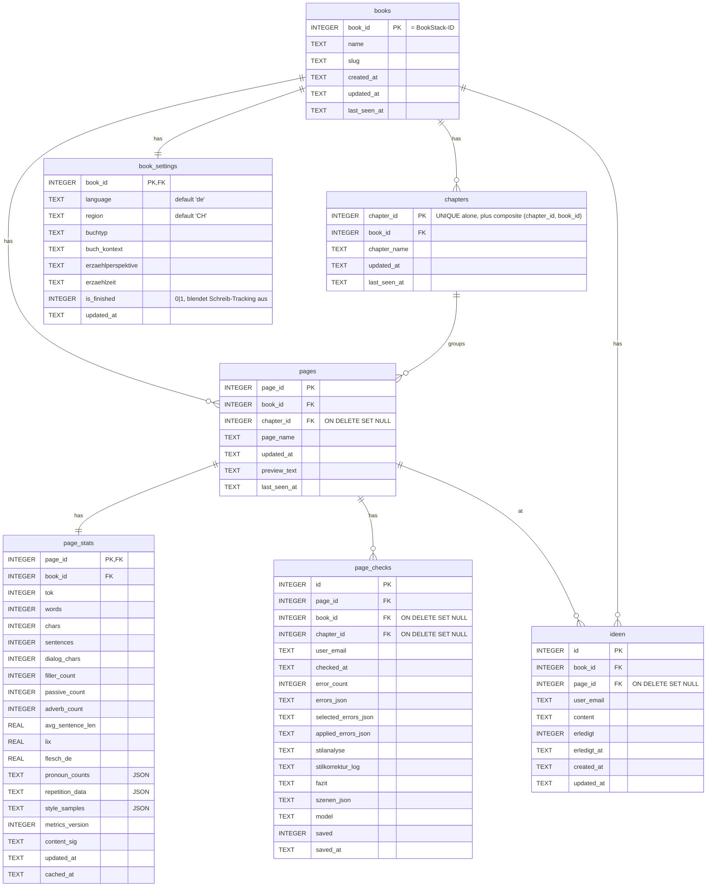
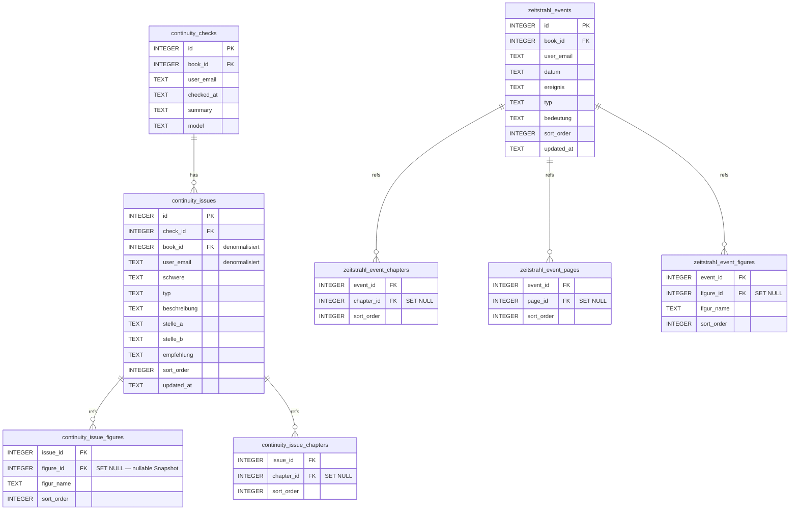

# ERD — bookstack-lektorat

Stand: Schema-Version 89, 46 Tabellen (ohne `sqlite_*`/`schema_version`/`sessions`).

Quelle: Live-Dump aus [lektorat.db](../lektorat.db) (`.schema --indent`) + [db/migrations.js](../db/migrations.js). Mermaid-Diagramme — in VSCode mit „Markdown Preview Mermaid Support" (oder GitHub) direkt sichtbar.

> **Pflege.** Datei MUSS bei jeder neuen Migration mitgepflegt werden — Stand-Zeile (Schema-Version, Tabellen-Anzahl) + betroffene Block-Definitionen + ggf. neue Mermaid-Tabelle/-Kante. Siehe Doku-Regel in [CLAUDE.md](../CLAUDE.md) → „Datenbank → Migration hinzufügen".

---

## 1 · Übersicht (alle FK-Kanten, ohne Attribute)

```mermaid
erDiagram
  books ||--o{ chapters              : has
  books ||--o{ pages                 : has
  chapters ||--o{ pages              : groups

  books ||--o{ figures               : has
  books ||--o{ locations             : has
  books ||--o{ figure_scenes         : has
  books ||--o{ figure_relations      : has
  books ||--o{ zeitstrahl_events     : has
  books ||--o{ continuity_checks     : has
  books ||--o{ continuity_issues     : has
  books ||--o{ book_reviews          : has
  books ||--o{ chapter_reviews       : has
  books ||--o{ book_stats_history    : has
  books ||--o{ page_stats            : has
  books ||--|| book_settings         : has
  books ||--o{ job_checkpoints       : has
  books ||--o{ job_runs              : has
  books ||--o{ chat_sessions         : has
  books ||--o{ ideen                 : has
  books ||--o{ pdf_export_profile    : has
  books ||--o{ user_page_usage       : has
  books ||--o{ writing_time          : has
  books ||--o{ lektorat_time         : has
  books ||--o{ chapter_extract_cache : has
  books ||--o{ book_extract_cache    : has
  books ||--o{ finetune_ai_cache     : has

  pages ||--o{ page_checks           : has
  pages ||--|| page_stats            : has
  pages ||--o{ chat_sessions         : has
  pages ||--o{ page_figure_mentions  : has
  pages ||--o{ figure_events         : at
  pages ||--o{ figure_scenes         : at
  pages ||--o{ zeitstrahl_event_pages: at
  pages ||--o{ ideen                 : at
  pages ||--o{ lektorat_time         : on
  pages ||--o{ locations             : firstMention

  chapters ||--o{ figure_appearances     : has
  chapters ||--o{ figure_events          : at
  chapters ||--o{ figure_scenes          : at
  chapters ||--o{ location_chapters      : has
  chapters ||--o{ continuity_issue_chapters : ref
  chapters ||--o{ zeitstrahl_event_chapters : at
  chapters ||--o{ chapter_reviews        : has
  chapters ||--o{ chapter_extract_cache  : cached
  chapters ||--o{ pages                  : groups
  chapters ||--o{ page_checks            : ref

  figures ||--o{ figure_tags             : tagged
  figures ||--o{ figure_appearances      : appears
  figures ||--o{ figure_events           : has
  figures ||--o{ scene_figures           : in
  figures ||--o{ location_figures        : at
  figures ||--o{ page_figure_mentions    : mentioned
  figures ||--o{ continuity_issue_figures: ref
  figures ||--o{ zeitstrahl_event_figures: ref
  figures ||--o{ figure_relations        : from
  figures ||--o{ figure_relations        : to

  locations ||--o{ scene_locations       : in
  locations ||--o{ location_figures      : has
  locations ||--o{ location_chapters     : at

  figure_scenes ||--o{ scene_figures     : has
  figure_scenes ||--o{ scene_locations   : has

  zeitstrahl_events ||--o{ zeitstrahl_event_chapters : refs
  zeitstrahl_events ||--o{ zeitstrahl_event_pages    : refs
  zeitstrahl_events ||--o{ zeitstrahl_event_figures  : refs

  continuity_checks ||--o{ continuity_issues          : has
  continuity_issues ||--o{ continuity_issue_figures   : refs
  continuity_issues ||--o{ continuity_issue_chapters  : refs

  chat_sessions ||--o{ chat_messages     : has
```

---

## 2 · Buch-Hierarchie + Lektorat-Kern



---

## 3 · Figuren + Beziehungen

```mermaid
erDiagram
  figures {
    INTEGER id           PK
    INTEGER book_id      FK
    TEXT    fig_id       "stable text-id from AI"
    TEXT    name
    TEXT    kurzname
    TEXT    typ
    TEXT    geschlecht
    TEXT    geburtstag
    TEXT    beruf
    TEXT    sozialschicht
    TEXT    rolle
    TEXT    motivation
    TEXT    konflikt
    TEXT    entwicklung
    TEXT    praesenz
    TEXT    erste_erwaehnung
    INTEGER erste_erwaehnung_page_id "kein FK!"
    TEXT    schluesselzitate
    TEXT    wohnadresse
    TEXT    beschreibung
    TEXT    meta
    INTEGER sort_order
    TEXT    user_email
    TEXT    updated_at
  }
  figure_tags {
    INTEGER figure_id PK,FK
    TEXT    tag       PK
  }
  figure_relations {
    INTEGER id              PK
    INTEGER book_id         FK
    INTEGER from_fig_id     FK
    INTEGER to_fig_id       FK
    TEXT    typ             "freie Bezeichnung"
    TEXT    beschreibung
    INTEGER machtverhaltnis
    TEXT    belege
    TEXT    user_email
  }
  figure_appearances {
    INTEGER figure_id   FK
    INTEGER chapter_id  FK
    INTEGER haeufigkeit
  }
  figure_events {
    INTEGER figure_id  FK
    INTEGER chapter_id FK "SET NULL"
    INTEGER page_id    FK "SET NULL"
    TEXT    datum
    TEXT    ereignis
    TEXT    bedeutung
    TEXT    typ
    INTEGER sort_order
  }
  page_figure_mentions {
    INTEGER page_id      PK,FK
    INTEGER figure_id    PK,FK
    INTEGER count
    INTEGER first_offset
  }
  figure_scenes {
    INTEGER id          PK
    INTEGER book_id     FK
    INTEGER chapter_id  FK "SET NULL"
    INTEGER page_id     FK "SET NULL"
    TEXT    titel
    TEXT    wertung
    TEXT    kommentar
    INTEGER sort_order
    TEXT    user_email
    TEXT    updated_at
  }
  scene_figures {
    INTEGER scene_id  PK,FK
    INTEGER figure_id PK,FK
  }
  scene_locations {
    INTEGER scene_id    PK,FK
    INTEGER location_id PK,FK
  }
  locations {
    INTEGER id           PK
    INTEGER book_id      FK
    TEXT    loc_id
    TEXT    name
    TEXT    typ
    TEXT    beschreibung
    TEXT    erste_erwaehnung
    INTEGER erste_erwaehnung_page_id FK "SET NULL"
    TEXT    stimmung
    INTEGER sort_order
    TEXT    user_email
    TEXT    updated_at
  }
  location_figures {
    INTEGER location_id PK,FK
    INTEGER figure_id   PK,FK
  }
  location_chapters {
    INTEGER location_id PK,FK
    INTEGER chapter_id  PK,FK
    INTEGER haeufigkeit
  }

  figures   ||--o{ figure_tags        : tagged
  figures   ||--o{ figure_relations   : from
  figures   ||--o{ figure_relations   : to
  figures   ||--o{ figure_appearances : appears
  figures   ||--o{ figure_events      : has
  figures   ||--o{ page_figure_mentions: mentioned
  figures   ||--o{ scene_figures      : in
  figures   ||--o{ location_figures   : at
  figure_scenes ||--o{ scene_figures  : has
  figure_scenes ||--o{ scene_locations: has
  locations ||--o{ scene_locations    : in
  locations ||--o{ location_figures   : has
  locations ||--o{ location_chapters  : at
```

---

## 4 · Continuity & Zeitstrahl



---

## 5 · Chat, Reviews, Jobs, Caches, User, Export

```mermaid
erDiagram
  chat_sessions {
    INTEGER id              PK
    INTEGER book_id         FK
    TEXT    kind            "page|book"
    INTEGER page_id         FK "NULL bei kind=book"
    TEXT    user_email
    TEXT    created_at
    TEXT    last_message_at
    TEXT    opening_page_text
  }
  chat_messages {
    INTEGER id          PK
    INTEGER session_id  FK
    TEXT    role        "user|assistant"
    TEXT    content
    TEXT    vorschlaege "JSON"
    TEXT    context_info
    INTEGER tokens_in
    INTEGER tokens_out
    INTEGER cache_read_in     "Claude prompt-cache hit (lokal: 0)"
    INTEGER cache_creation_in "Claude prompt-cache write (lokal: 0)"
    TEXT    provider          "claude|ollama|llama"
    TEXT    model
    REAL    tps
    TEXT    created_at
  }

  book_reviews {
    INTEGER id          PK
    INTEGER book_id     FK
    TEXT    user_email
    TEXT    reviewed_at
    TEXT    review_json
    TEXT    model
  }
  chapter_reviews {
    INTEGER id          PK
    INTEGER book_id     FK
    INTEGER chapter_id  FK
    TEXT    user_email
    TEXT    reviewed_at
    TEXT    review_json
    TEXT    model
  }
  book_stats_history {
    INTEGER id            PK
    INTEGER book_id       FK
    TEXT    recorded_at
    INTEGER page_count
    INTEGER words
    INTEGER chars
    INTEGER tok
    INTEGER unique_words
    INTEGER chapter_count
    REAL    avg_sentence_len
    REAL    avg_lix
    REAL    avg_flesch_de
  }

  job_runs {
    INTEGER id          PK
    TEXT    job_id      "UNIQUE"
    TEXT    type
    INTEGER book_id     FK "SET NULL"
    TEXT    user_email
    TEXT    label
    TEXT    status      "queued|running|done|error|cancelled"
    TEXT    queued_at
    TEXT    started_at
    TEXT    ended_at
    INTEGER tokens_in
    INTEGER tokens_out
    INTEGER cache_read_in     "Claude prompt-cache hit (lokal: 0)"
    INTEGER cache_creation_in "Claude prompt-cache write (lokal: 0)"
    TEXT    provider          "claude|ollama|llama"
    TEXT    model
    REAL    tokens_per_sec
    TEXT    error
    TEXT    error_params  "JSON, i18n-Params zum error-Key"
  }
  job_checkpoints {
    INTEGER id          PK
    TEXT    job_type
    INTEGER book_id     FK
    TEXT    user_email
    TEXT    data
    TEXT    updated_at
  }
  chapter_extract_cache {
    INTEGER book_id      PK,FK
    TEXT    user_email   PK
    INTEGER chapter_id   PK,FK
    TEXT    phase        PK
    TEXT    pages_sig
    TEXT    extract_json
    TEXT    cached_at
  }
  book_extract_cache {
    INTEGER book_id      PK,FK
    TEXT    user_email   PK
    TEXT    pages_sig
    TEXT    extract_json
    TEXT    cached_at
  }
  finetune_ai_cache {
    INTEGER book_id    PK,FK
    TEXT    user_email PK
    TEXT    scope      PK
    TEXT    scope_key  PK
    TEXT    version    PK
    TEXT    sig
    TEXT    result_json
    TEXT    cached_at
  }

  users {
    TEXT    email             PK
    TEXT    name
    TEXT    locale
    TEXT    theme
    TEXT    default_buchtyp
    TEXT    default_language
    TEXT    default_region
    TEXT    focus_granularity
    INTEGER daily_goal_chars  "NULL → Frontend-Fallback 1500"
    TEXT    created_at
    TEXT    last_login_at
    TEXT    last_seen_at
  }
  user_tokens {
    TEXT email      PK
    TEXT token_id   "AES-256-GCM"
    TEXT token_pw   "AES-256-GCM"
    TEXT updated_at
  }
  user_activity {
    TEXT    user_email PK
    TEXT    date       PK
    INTEGER seconds
    TEXT    first_at
    TEXT    last_at
  }
  user_feature_usage {
    TEXT    user_email   PK
    TEXT    feature_key  PK
    INTEGER last_used
    INTEGER use_count
  }
  user_page_usage {
    TEXT    user_email PK
    INTEGER page_id    PK
    INTEGER book_id    FK
    INTEGER last_used
    INTEGER use_count
  }
  writing_time {
    INTEGER id         PK
    TEXT    user_email
    INTEGER book_id    FK
    TEXT    date
    INTEGER seconds
  }
  lektorat_time {
    INTEGER id         PK
    TEXT    user_email
    INTEGER book_id    FK
    INTEGER page_id    FK
    TEXT    date
    INTEGER seconds
  }

  pdf_export_profile {
    INTEGER id          PK
    TEXT    kind        "book|user_default"
    INTEGER book_id     FK "NULL bei user_default"
    TEXT    user_email
    TEXT    name
    TEXT    config_json
    BLOB    cover_image
    TEXT    cover_mime
    INTEGER is_default
    INTEGER created_at
    INTEGER updated_at
  }
  font_cache {
    TEXT    family    PK
    INTEGER weight    PK
    TEXT    style     PK
    BLOB    ttf
    INTEGER fetched_at
  }

  chat_sessions ||--o{ chat_messages : has
```



---

## 6 · Verbesserungsvorschläge

Priorisiert nach Wirkung. Jede Änderung als eigene Migration via Recreate-Pattern (PRAGMA foreign_keys = OFF, CREATE _new, INSERT SELECT, RENAME, foreign_key_check).

### Kritisch — Daten-Integrität

1. **Bridge-Tabellen ohne PK ⇒ Duplikat-Zeilen möglich.**
   Betroffen: `continuity_issue_figures`, `continuity_issue_chapters`, `zeitstrahl_event_chapters`, `zeitstrahl_event_pages`, `zeitstrahl_event_figures`, `figure_events`.
   Fix: Composite-PK ergänzen, z.B. `PRIMARY KEY (issue_id, COALESCE(figure_id,0), figur_name)` bzw. `(event_id, page_id)`. Bei `figure_events` Surrogate-PK `id INTEGER PRIMARY KEY AUTOINCREMENT` (nötig für Update/Delete einzelner Events).

2. **`figure_relations` ohne UNIQUE ⇒ Duplikat-Kanten.**
   Bsp. zwei Inserts derselben (from_fig_id, to_fig_id, typ) erzeugen 2 Zeilen. Soziogramm rendert dann doppelte Edges.
   Fix: `UNIQUE(from_fig_id, to_fig_id, typ, user_email)`. Vorher Pre-Cleanup gegen vorhandene Dupes.

3. **`figures.erste_erwaehnung_page_id` ohne FK.**
   Plain INTEGER, hat aber dieselbe Semantik wie `locations.erste_erwaehnung_page_id` (FK). Page-Delete hinterlässt dangling Refs.
   Fix: `REFERENCES pages(page_id) ON DELETE SET NULL` + Pre-Cleanup orphans nullen.

4. **`user_email`-Spalten ohne FK auf `users(email)`.**
   `figures`, `locations`, `figure_scenes`, `figure_relations`, `page_checks`, `book_reviews`, `chapter_reviews`, `chat_sessions`, `continuity_*`, `zeitstrahl_events`, `ideen`, `lektorat_time`, `writing_time`, `user_activity`, `user_feature_usage`, `user_page_usage`, `user_tokens`, `pdf_export_profile`, `chapter_extract_cache`, `book_extract_cache`, `finetune_ai_cache`, `job_runs`, `job_checkpoints`.
   Bei User-Delete bleiben Orphans; bei Email-Tippfehler im Insert-Pfad keine Constraint-Verletzung.
   Fix: Schrittweise FKs ergänzen — zuerst neutral mit `ON DELETE SET NULL` (Reviews/Checks: User wegnehmen, Daten bleiben), für reine User-Caches `ON DELETE CASCADE` (`user_*`-Tabellen, `*_cache`-Tabellen, `user_tokens`). Composite-Tabellen mit `user_email NOT NULL DEFAULT ''` müssen vorher konsolidiert werden, sonst FK auf `''` (kein User-Match) bricht.

### Hoch — Schema-Hygiene

5. **`chapters` redundanter PK.**
   Aktuell: `PRIMARY KEY(chapter_id, book_id)` UND `UNIQUE(chapter_id)`. Composite-PK ist redundant, weil `chapter_id` allein bereits unique ist.
   Fix: PK auf `(chapter_id)` reduzieren; Composite als `UNIQUE(chapter_id, book_id)` behalten falls Cross-Book-Defensive gewünscht (aktuell gemäss CLAUDE.md Composite-FK von einigen Tabellen erwartet — Verwendungen prüfen, sonst droppen).

6. **`continuity_issues.book_id`/`user_email` denormalisiert.**
   Beides aus `check_id → continuity_checks` ableitbar. Risiko: Drift, wenn Migration die eine Tabelle ändert, die andere nicht.
   Fix: Wenn Performance kein Faktor ist (≤ 5'000 Issues pro Buch realistisch), Spalten droppen und Queries auf JOIN umstellen. Sonst Trigger oder DB-Test, der Konsistenz prüft.

7. **`chat_messages` hat Spaltenartefakte aus ALTERs.**
   Schema-Dump zeigt die Reihenfolge `… context_info TEXT , tps REAL` — kosmetisch, aber zeigt Migrations-Drift. Optional Recreate-Pass für saubere Reihenfolge.

8. **`figure_events` ohne `id`-PK.**
   Jede Spalte als „Tupel" geführt; `WHERE figure_id=? AND datum=? AND ereignis=?` ist der einzige Lookup-Pfad. Update/Delete einzelner Events nur über DELETE+INSERT der ganzen Figur.
   Fix: `id INTEGER PRIMARY KEY AUTOINCREMENT` ergänzen; Read/Write-Pfad in [db/figures.js](../db/figures.js) bleibt kompatibel.

9. **Checks für Enum-artige Felder fehlen.**
   - `continuity_issues.schwere ∈ {kritisch, mittel, gering}` (oder analog) — keine CHECK-Constraint.
   - `continuity_issues.typ`, `figure_events.typ`, `zeitstrahl_events.typ` ähnlich.
   - `finetune_ai_cache.scope ∈ {reverse-prompts, fact-qa, reasoning-backfill}` (laut CLAUDE.md) — keine CHECK.
   Fix: CHECK-Constraints in passenden Recreate-Migrationen (Werte zuerst auditieren).

### Mittel — Konsolidierung

10. **`writing_time` und `lektorat_time` fast identisch.**
    Unterschied nur `page_id`-Spalte. Eine Tabelle mit nullable `page_id` würde reichen — `writing_time` ist `lektorat_time WHERE page_id IS NULL` (Buchebene).
    Fix: Merge in `writing_time` mit nullable `page_id`; alte Tabelle nach Daten-Migration droppen. Reduziert Duplicate Code in [routes/usersettings.js](../routes/usersettings.js)/[routes/sync.js](../routes/sync.js)-Reads.

11. **`locations.loc_id` UNIQUE-Constraint per `(book_id, loc_id, user_email)` statt FK-Target.**
    `figures.fig_id` analog. Das erlaubt mehrere Locations mit derselben `loc_id` über verschiedene User → User-pro-Buch-Scope ist gewollt. Aber: Wenn die App auf Single-User-pro-Buch konvergiert (Self-hosted-OSS), wäre `(book_id, loc_id)` einfacher. Optional.

12. **`books.slug` nicht UNIQUE.**
    BookStack-Side hat unique slugs; Server kennt sie und könnte einen Constraint setzen. Verhindert ungewollte Doppel-Inserts bei Sync-Bugs.

### Niedrig — Performance/Cosmetic

13. **`sessions.expire` ohne Index.**
    Express-Session GC-Scan macht `DELETE WHERE expire < ?` — Full-Scan auf wachsender Sessions-Tabelle. `CREATE INDEX idx_sessions_expire ON sessions(expire)` lohnt ab ~10k Zeilen.

14. **`user_tokens` ohne `users(email)`-FK.**
    Bei User-Delete bleibt Token-Eintrag verwaist. Fix unter Punkt 4.

15. **`pdf_export_profile.cover_image` als BLOB inline.**
    PDF/A-Cover bis ~5 MB im SQLite-File aufgebläht. Bei vielen Profilen Backup-Grösse beachten. Alternative: Filesystem-Pfad + Hash.

16. **`figures.meta` als Catch-All-JSON.**
    Bequem, aber blockiert Indexes/Migrations. Wenn neue Felder mehrfach aus `meta` extrahiert wurden, evtl. Zeit für eigene Spalte.

---

## 7 · Pflege

Bei jeder neuen Migration in [db/migrations.js](../db/migrations.js):

1. Stand-Zeile oben anpassen (Version, Tabellen-Anzahl).
2. Betroffene Block-Definitionen anfassen (neue Spalte → Zeile in `{}`, neuer Typ-Hinweis als Annotation in `"…"`).
3. Bei neuer Tabelle: Block ergänzen + FK-Kante in Section 1 (Übersicht) + im passenden thematischen Sub-Diagramm.
4. Bei neuer FK-Kante auf bestehende Tabellen: Kante in Section 1 nachziehen.
5. Falls eine Empfehlung aus Section 6 umgesetzt wurde: Punkt löschen.

Live-Schema kontrollieren:

```
sqlite3 lektorat.db ".schema --indent" > /tmp/schema_full.sql
sqlite3 lektorat.db "SELECT version FROM schema_version;"
```

Diagramm-Quellen sind die `REFERENCES`-Klauseln aus dem Dump. Mermaid-Diagramme händisch nachziehen — Auto-Generator wäre möglich, aber die Sub-Diagramme leben von kuratierter Auswahl, kein vollautomatisches Tool produziert sie sinnvoll.
